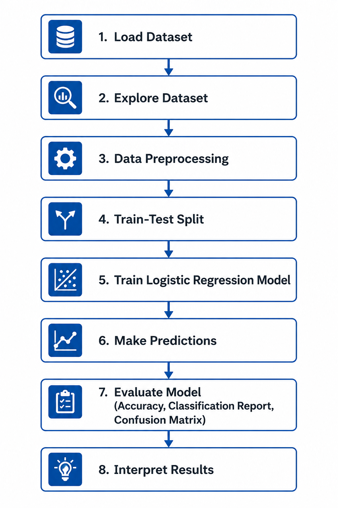

# Logistic Regression — From Intuition to Interview

> **ML Internship Series** · Supervised Learning · Classification · Placement-Oriented

[](https://www.python.org/)
[](https://scikit-learn.org/)
[](https://numpy.org/)
[](https://www.kaggle.com/)
[](LICENSE)

---

## Introduction

This repository is part of an **ML Internship curriculum** designed to build placement-ready knowledge in classical machine learning. Logistic Regression is not just a starting algorithm — it is the foundation on which neural networks, probabilistic classifiers, and generalized linear models are all built.

By the end of this module, you will not only know how Logistic Regression works but also *why* it is designed the way it is — something that separates strong interview candidates from average ones.

The companion Jupyter notebook (`logistic_regression.ipynb`) implements everything from scratch and using scikit-learn on a **real-world Kaggle dataset**: the [Heart Disease UCI Dataset](https://www.kaggle.com/datasets/ronitf/heart-disease-uci). No synthetic data. No toy examples. Real features, real messiness, real decisions.

---

## Table of Contents

1. [Learning Objectives](#1-learning-objectives)
2. [What is Logistic Regression?](#2-what-is-logistic-regression)
3. [Real-World Applications](#3-real-world-applications)
4. [Core Concepts and Intuition](#4-core-concepts-and-intuition)
5. [Mathematical Formulation](#5-mathematical-formulation)
6. [Step-by-Step Working of the Algorithm](#6-step-by-step-working-of-the-algorithm)
7. [Assumptions of Logistic Regression](#7-assumptions-of-logistic-regression)
8. [Advantages and Limitations](#8-advantages-and-limitations)
9. [Comparison with Related Algorithms](#9-comparison-with-related-algorithms)
10. [Implementation Overview](#10-implementation-overview)
11. [Handling Practical Challenges and Edge Cases](#11-handling-practical-challenges-and-edge-cases)
12. [Common Failure Modes and Misconceptions](#12-common-failure-modes-and-misconceptions)
13. [Top 5 Interview Questions with Answers](#13-top-5-interview-questions-with-answers)
14. [Prerequisites](#14-prerequisites)
15. [Connections to Other ML Algorithms](#15-connections-to-other-ml-algorithms)
16. [Quick Revision Table](#16-quick-revision-table)
17. [Key Takeaways](#17-key-takeaways)
18. [Workflow Diagram](#18-workflow-diagram)
19. [References and Further Reading](#19-references-and-further-reading)

---

## 1. Learning Objectives

After studying this module, you should be able to:

**Explain:**
- Why Logistic Regression outputs probabilities rather than raw scores
- The role of the sigmoid function and what happens at its extremes
- Why log-loss is the correct choice of loss function for classification
- What the decision boundary looks like and how the threshold affects predictions
- The philosophical difference between Logistic Regression and Linear Regression

**Derive (conceptually, without proofs):**
- How maximum likelihood estimation leads to the log-loss objective
- Why there is no closed-form solution (unlike Linear Regression)
- How L1 and L2 regularization affect the weight distribution differently

**Implement:**
- Logistic Regression from scratch using NumPy with gradient descent
- A production-quality pipeline using scikit-learn
- Threshold tuning using precision-recall curves
- Strategies to handle class imbalance in real datasets

---

## 2. What is Logistic Regression?

Here is something that confuses almost every beginner: **Logistic Regression is a classification algorithm**, not a regression algorithm. The word *regression* refers to how it was built — on top of linear regression machinery — not what it does.

**The one-line version:** Given a set of input features, Logistic Regression estimates the probability that a data point belongs to a particular class.

**A grounded analogy:** Imagine a cardiologist reviewing a patient's test results — age, cholesterol level, resting blood pressure, ECG readings. The cardiologist doesn't say *"heart disease score: 4.7."* They say *"this patient has a 73% chance of having heart disease."* That probability — derived from a combination of weighted evidence — is exactly what Logistic Regression computes. The decision (refer for further testing or not) then comes from applying a threshold to that probability.

The key distinction from linear regression is in what you are modeling:
- **Linear Regression** models a continuous outcome: *How many units will we sell?*
- **Logistic Regression** models a probability: *Will this customer churn — yes or no?*

This shift from predicting a value to predicting a probability is what makes Logistic Regression the right tool for classification tasks.

---

## 3. Real-World Applications

Logistic Regression is not just a textbook algorithm. It is running in production systems at scale across many industries:

| Domain | Application | What the Output Means |
|---|---|---|
| **Healthcare** | Heart disease prediction, cancer diagnosis | Probability that a patient has a condition |
| **Finance** | Credit scoring, loan default prediction | Probability of a borrower defaulting |
| **E-commerce** | Churn prediction, purchase intent | Probability a customer will leave or buy |
| **Cybersecurity** | Fraud detection, anomaly classification | Probability a transaction is fraudulent |
| **NLP (as baseline)** | Spam detection, sentiment classification | Probability a message belongs to a class |
| **Marketing** | Email click-through prediction | Probability a user will click an ad |

**Healthcare deep-dive:** In the Heart Disease UCI Dataset used in this repository, the model takes features like a patient's age, sex, chest pain type, fasting blood sugar, and maximum heart rate to output the probability of having heart disease. In a real clinical decision support system, the threshold for flagging a patient would be set very low — you would rather have false positives (unnecessary tests) than false negatives (missed diagnoses).

---

## 4. Core Concepts and Intuition

### 4.1 From Linear Score to Probability

Linear regression produces a score that can range from −∞ to +∞. You cannot interpret −3.2 or 47.8 as probabilities. We need a function that squashes any real number into the range (0, 1). That function is the **sigmoid**.

### 4.2 The Sigmoid Function

The sigmoid function looks like a stretched "S" curve. Feed it any number and it gives you something between 0 and 1. Feed it a very large positive number and you get something close to 1. Feed it a very large negative number and you get something close to 0. At exactly 0, you get 0.5.

This behavior is exactly what we want: a large positive linear score should confidently predict class 1, a large negative score should confidently predict class 0, and scores near 0 represent genuine uncertainty.

### 4.3 Log-Odds and Linear Modeling

Logistic Regression doesn't model probability directly as a linear function (that would let probabilities exceed 1). Instead, it models the **log-odds** — the logarithm of the ratio of probability of class 1 to probability of class 0 — as a linear function of features.

This is elegant: log-odds range from −∞ to +∞ (suitable for linear modeling), and we can always convert back to a probability using the sigmoid.

**What a coefficient tells you:** A coefficient of 0.5 on the "age" feature means that for each one-year increase in age, the log-odds of heart disease increase by 0.5, holding all other features constant. This interpretability is one of Logistic Regression's biggest strengths.

### 4.4 The Decision Boundary

The decision boundary is the set of points where the model's predicted probability is exactly 0.5. On one side of this boundary, the model predicts class 1; on the other side, class 0. In two dimensions, this boundary is a straight line. In higher dimensions, it is a hyperplane. This linear nature is both a strength (simple, interpretable) and a limitation (cannot model curved boundaries without feature engineering).

### 4.5 Threshold vs. Probability

The default decision threshold is 0.5, but this is rarely the right choice in practice. In fraud detection, you might set the threshold at 0.2 — flagging any transaction with more than a 20% chance of being fraudulent. In a spam filter, you might use 0.7 — only marking an email as spam if you are quite confident. Threshold selection is a business decision, not a mathematical one.

---

## 5. Mathematical Formulation

### 5.1 Sigmoid Function

$$\sigma(z) = \frac{1}{1 + e^{-z}}$$

| Symbol | Meaning |
|---|---|
| `σ(z)` | Output of the sigmoid — the predicted probability, always in (0, 1) |
| `z` | The linear combination of features: z = w₁x₁ + w₂x₂ + ... + wₙxₙ + b |
| `e` | Euler's number (~2.718), base of natural logarithms |

**Significance:** This function converts a raw linear score into a valid probability. The shape guarantees that no matter how extreme the input, the output stays bounded. It also introduces a smooth, differentiable non-linearity that makes gradient-based optimization work cleanly.

---

### 5.2 Model Hypothesis

$$\hat{y} = \sigma(w^T x + b)$$

| Symbol | Meaning |
|---|---|
| `ŷ` | Predicted probability that the label is 1 (e.g., probability of heart disease) |
| `w` | Weight vector — one weight per feature, learned during training |
| `x` | Feature vector — one value per feature for a single data point |
| `wᵀx` | Dot product of weights and features (same as w₁x₁ + w₂x₂ + ... + wₙxₙ) |
| `b` | Bias term — shifts the decision boundary independently of the features |

**Significance:** This is the complete prediction equation. All the model's knowledge about the training data is encoded in `w` and `b`. Given a new patient's features, this equation gives you the probability of disease in a single forward pass.

---

### 5.3 Log-Loss (Binary Cross-Entropy)

$$L = -\frac{1}{m} \sum_{i=1}^{m} \left[ y^{(i)} \log(\hat{y}^{(i)}) + (1 - y^{(i)}) \log(1 - \hat{y}^{(i)}) \right]$$

| Symbol | Meaning |
|---|---|
| `L` | The total loss across the training set — what we want to minimize |
| `m` | Number of training examples |
| `y⁽ⁱ⁾` | True label for the i-th example (0 or 1) |
| `ŷ⁽ⁱ⁾` | Predicted probability for the i-th example |
| `log` | Natural logarithm |

**Significance:** This loss function has a crucial property: it punishes **confident wrong answers** astronomically. If the true label is 1 and the model predicts ŷ = 0.001, then log(0.001) ≈ −6.9, creating a huge loss. This asymmetric pressure forces the model to be well-calibrated. Mean Squared Error does not have this property, which is why it fails as a loss function for classification with sigmoid activations.

---

### 5.4 Gradient Update Rule

$$w := w - \alpha \cdot \frac{\partial L}{\partial w} = w - \frac{\alpha}{m} X^T (\hat{y} - y)$$

| Symbol | Meaning |
|---|---|
| `w` | Weight vector being updated |
| `α` | Learning rate — controls how large each update step is |
| `∂L/∂w` | Gradient of the loss with respect to weights |
| `X` | Feature matrix (m × n): m training examples, n features |
| `ŷ − y` | Vector of prediction errors across all training examples |

**Significance:** This update rule has a remarkable property — it looks almost identical to the gradient update for linear regression, yet operates through the non-linear sigmoid. It is also perfectly intuitive: if the model's prediction is higher than the true label (ŷ > y), the weights are nudged downward. If the prediction is too low, weights are nudged upward. The magnitude of the nudge is proportional to how wrong the prediction is.

---

### 5.5 Regularized Objective

$$J(w) = L + \lambda \|w\|_p$$

| Symbol | Meaning |
|---|---|
| `J(w)` | Total objective to minimize (loss + penalty) |
| `L` | The log-loss from the training data |
| `λ` (lambda) | Regularization strength — larger λ means stronger penalty on weight size |
| `‖w‖ₚ` | The Lₚ norm of the weight vector (p=1 for Lasso, p=2 for Ridge) |

**Significance:** Without regularization, Logistic Regression weights can grow arbitrarily large, especially when classes are well-separated or features are collinear. The regularization term acts as a budget constraint: the optimizer must balance fitting the training data against keeping the weights small. In scikit-learn, the parameter `C = 1/λ` — a smaller C means stronger regularization.

---

## 6. Step-by-Step Working of the Algorithm

**Step 1 — Initialize weights.** Set all weights `w` and bias `b` to zero (or small random values).

**Step 2 — Compute the linear score.** For each training example, compute z = wᵀx + b. This is the same operation as linear regression.

**Step 3 — Apply the sigmoid.** Convert each score z to a probability ŷ = σ(z). All outputs are now in (0, 1).

**Step 4 — Compute the loss.** Calculate how far the predictions are from the true labels using binary cross-entropy. A perfect model would have loss near 0.

**Step 5 — Compute the gradient.** Calculate the direction and magnitude by which each weight should change to reduce the loss.

**Step 6 — Update the weights.** Take a step in the direction of the negative gradient (downhill on the loss surface): w := w − α · gradient.

**Step 7 — Repeat Steps 2–6.** Continue for a fixed number of iterations or until the loss stops decreasing meaningfully. This iterative process is called **gradient descent**.

**Step 8 — Predict on new data.** For a new input x, compute ŷ = σ(wᵀx + b). If ŷ ≥ threshold (default 0.5), predict class 1; otherwise class 0.

> **Why no closed-form solution?** Linear regression has a formula that directly gives the optimal weights: w = (XᵀX)⁻¹Xᵀy. Logistic Regression has no such formula because the sigmoid makes the loss function non-linear in the weights. We must iterate — hence gradient descent (or smarter variants like L-BFGS).

---

## 7. Assumptions of Logistic Regression

Logistic Regression works well when these conditions hold. Violating them doesn't always break the model, but it will hurt performance and interpretability:

1. **Linear decision boundary.** The algorithm assumes classes are separable by a hyperplane in the feature space. If the true boundary is curved or complex, the model will underfit regardless of how much data you have.

2. **No severe multicollinearity.** When two features are highly correlated (e.g., "weight in kg" and "weight in lbs"), the model struggles to assign individual credit to each. It might give one a large positive weight and the other a large negative weight — both capturing the same information in a noisy, unstable way. L2 regularization mitigates this.

3. **Large enough sample size.** Logistic Regression is a parametric model that relies on asymptotic properties to give reliable coefficients. A common rule of thumb is at least 10–20 positive examples per feature. With 50 features and only 30 positive examples, the model is likely to overfit.

4. **No extreme outliers.** Outliers can exert disproportionate influence on the gradient updates, pulling the decision boundary away from its optimal position.

5. **Features are on comparable scales.** Gradient descent converges much faster when features are standardized (mean 0, standard deviation 1). Without scaling, a feature with values in the thousands dominates a feature with values near 1, causing slow and unstable training.

6. **Independence of observations.** Each training example should be independent of the others. Time-series data or repeated measurements from the same subject violate this assumption.

---

## 8. Advantages and Limitations

### Advantages

- **Probabilistic output.** The model naturally outputs calibrated probabilities, which are directly useful in risk-based decision making (e.g., credit scoring, medical triage). Unlike SVMs or decision trees, you get probabilities without post-hoc calibration in most cases.
- **Highly interpretable.** Each coefficient has a concrete meaning: it represents the change in log-odds per unit change in that feature. This is critical in regulated industries where model decisions must be explainable.
- **Fast to train and predict.** Even on millions of examples, logistic regression training is computationally cheap compared to ensemble methods or neural networks.
- **Performs well in high-dimensional sparse data.** Text classification with bag-of-words features is a classic use case where logistic regression is surprisingly competitive.
- **Strong baseline.** If a logistic regression model beats your tuned XGBoost, something unusual is happening — the problem is likely more linear than you expected, or your tree model is overfitting.
- **Convex loss function.** Gradient descent on the log-loss is guaranteed to find the global optimum. No local minima traps.

### Limitations

- **Assumes a linear decision boundary.** If the true separation in your data is circular, parabolic, or otherwise non-linear, logistic regression will fail — no matter how much data you feed it.
- **Requires feature engineering for non-linear patterns.** Interaction terms and polynomial features can help, but they must be crafted manually or via a pipeline.
- **Sensitive to irrelevant features.** Without regularization, noise features can degrade performance significantly.
- **Cannot handle missing values natively.** Imputation must be done as a preprocessing step.
- **Not ideal for image, audio, or raw text.** These data types require architectures that can learn hierarchical representations (CNNs, Transformers).

---

## 9. Comparison with Related Algorithms

### 9.1 Logistic Regression vs. Linear Regression

| Dimension | Logistic Regression | Linear Regression |
|---|---|---|
| **Task** | Classification | Regression |
| **Output** | Probability ∈ (0, 1) | Continuous value ∈ (−∞, +∞) |
| **Activation** | Sigmoid (logistic function) | None (identity) |
| **Loss function** | Binary cross-entropy (log-loss) | Mean Squared Error (MSE) |
| **Closed-form solution** | No — must use iterative optimization | Yes — Normal Equation exists |
| **Decision boundary** | Hyperplane (for classification) | No concept of decision boundary |
| **Interpretability** | Coefficients = log-odds | Coefficients = direct effect on output |

**The key insight:** Both models compute the same linear combination wᵀx + b. The difference is entirely in what they do with that score afterward. Linear regression outputs it directly; logistic regression passes it through sigmoid and interprets it as a probability.

---

### 9.2 Logistic Regression vs. Naive Bayes

| Dimension | Logistic Regression | Naive Bayes |
|---|---|---|
| **Type** | Discriminative model | Generative model |
| **What it models** | P(y \| x) directly | P(x, y) = P(x \| y) · P(y) |
| **Feature independence assumption** | Not assumed | Strongly assumed |
| **Performance with large data** | Generally better | Generally worse |
| **Performance with small data** | Can overfit | More robust |
| **Training speed** | Requires iteration | Single pass through data |
| **Calibration** | Better calibrated | Often poorly calibrated |

**The key insight:** Logistic Regression is *discriminative* — it learns the boundary between classes directly from the data. Naive Bayes is *generative* — it models how each class generates features, then uses Bayes' theorem to classify. When features are truly independent (rare in practice), both converge to the same solution with enough data. With limited data, Naive Bayes's strong assumptions can actually help.

---

## 10. Implementation Overview

### 10.1 From Scratch using NumPy

The scratch implementation below demonstrates the core algorithm without any ML library. All mathematical steps from Section 5 are directly visible in the code.

```python
import numpy as np

class LogisticRegressionScratch:
    def __init__(self, learning_rate=0.01, n_iterations=1000, lambda_reg=0.01):
        self.lr = learning_rate
        self.n_iter = n_iterations
        self.lambda_reg = lambda_reg   # L2 regularization strength
        self.weights = None
        self.bias = None
        self.loss_history = []

    def _sigmoid(self, z):
        # Clip z to avoid numerical overflow in exp
        z = np.clip(z, -500, 500)
        return 1 / (1 + np.exp(-z))

    def fit(self, X, y):
        m, n = X.shape
        self.weights = np.zeros(n)
        self.bias = 0.0

        for _ in range(self.n_iter):
            # Forward pass
            z = X @ self.weights + self.bias
            y_hat = self._sigmoid(z)

            # Compute log-loss
            loss = -np.mean(
                y * np.log(y_hat + 1e-15) + (1 - y) * np.log(1 - y_hat + 1e-15)
            )
            # L2 regularization term
            loss += (self.lambda_reg / (2 * m)) * np.sum(self.weights ** 2)
            self.loss_history.append(loss)

            # Gradients
            error = y_hat - y
            dw = (X.T @ error) / m + (self.lambda_reg / m) * self.weights
            db = np.mean(error)

            # Weight update
            self.weights -= self.lr * dw
            self.bias   -= self.lr * db

        return self

    def predict_proba(self, X):
        return self._sigmoid(X @ self.weights + self.bias)

    def predict(self, X, threshold=0.5):
        return (self.predict_proba(X) >= threshold).astype(int)


# --- Usage on Heart Disease Dataset ---
from sklearn.model_selection import train_test_split
from sklearn.preprocessing import StandardScaler
from sklearn.metrics import classification_report
import pandas as pd

df = pd.read_csv("heart.csv")          # Kaggle Heart Disease UCI dataset
X = df.drop("target", axis=1).values
y = df["target"].values

X_train, X_test, y_train, y_test = train_test_split(
    X, y, test_size=0.2, random_state=42, stratify=y
)

scaler = StandardScaler()
X_train = scaler.fit_transform(X_train)
X_test  = scaler.transform(X_test)

model = LogisticRegressionScratch(learning_rate=0.1, n_iterations=2000, lambda_reg=0.1)
model.fit(X_train, y_train)
y_pred = model.predict(X_test)

print(classification_report(y_test, y_pred))
```

---

### 10.2 Using Scikit-learn

The scikit-learn implementation is what you would use in a production pipeline. It handles numerical stability, solver selection, regularization, and multi-class extensions automatically.

```python
from sklearn.linear_model import LogisticRegression
from sklearn.pipeline import Pipeline
from sklearn.preprocessing import StandardScaler
from sklearn.model_selection import cross_val_score, StratifiedKFold
from sklearn.metrics import (
    roc_auc_score, average_precision_score,
    classification_report, ConfusionMatrixDisplay
)
import matplotlib.pyplot as plt

# Build a robust pipeline — preprocessing + model in one object
pipeline = Pipeline([
    ("scaler", StandardScaler()),
    ("clf", LogisticRegression(
        C=1.0,              # Inverse regularization strength (1/λ)
        penalty="l2",       # Ridge regularization
        solver="lbfgs",     # Best for small-medium datasets, multi-class
        max_iter=1000,      # Increase if solver warns about convergence
        class_weight=None,  # Set to "balanced" if classes are imbalanced
        random_state=42
    ))
])

# Stratified k-fold ensures each fold has same class ratio
cv = StratifiedKFold(n_splits=5, shuffle=True, random_state=42)
cv_scores = cross_val_score(pipeline, X_train, y_train, cv=cv, scoring="roc_auc")
print(f"Cross-val AUC: {cv_scores.mean():.3f} ± {cv_scores.std():.3f}")

# Final fit and evaluation
pipeline.fit(X_train, y_train)
y_proba = pipeline.predict_proba(X_test)[:, 1]
y_pred  = pipeline.predict(X_test)

print(f"\nTest AUC-ROC: {roc_auc_score(y_test, y_proba):.3f}")
print(f"Test AUC-PR:  {average_precision_score(y_test, y_proba):.3f}")
print("\n", classification_report(y_test, y_pred, target_names=["No Disease", "Disease"]))

# Confusion matrix
ConfusionMatrixDisplay.from_estimator(pipeline, X_test, y_test,
    display_labels=["No Disease", "Disease"], cmap="Blues")
plt.title("Logistic Regression — Heart Disease Prediction")
plt.tight_layout()
plt.savefig("images/confusion_matrix.png", dpi=150)
plt.show()

# Feature importance via coefficients
coef = pipeline.named_steps["clf"].coef_[0]
feature_names = df.drop("target", axis=1).columns
importance_df = pd.DataFrame({"Feature": feature_names, "Coefficient": coef})
importance_df = importance_df.reindex(
    importance_df["Coefficient"].abs().sort_values(ascending=False).index
)
print("\nTop features by coefficient magnitude:")
print(importance_df.head(10).to_string(index=False))
```

> **Solver Guide:** `liblinear` — binary, small data, supports L1. `lbfgs` — multi-class, medium data, L2 only. `saga` — large or sparse datasets, supports all penalties including Elastic Net.

---

## 11. Handling Practical Challenges and Edge Cases

### 11.1 Class Imbalance

Class imbalance is the rule in real-world classification, not the exception. The Heart Disease dataset is relatively balanced, but fraud detection datasets often have 1 positive example for every 500 negatives.

**What goes wrong:** A model trained on heavily imbalanced data learns that the easiest path to low loss is predicting the majority class for everything. It achieves high accuracy while being completely useless.

**Strategies, in order of preference:**

1. **`class_weight='balanced'`** (start here) — scikit-learn automatically adjusts each class's contribution to the loss in inverse proportion to its frequency. Zero additional code, often very effective.
2. **Threshold tuning** — Lower the classification threshold from 0.5 so the model is more sensitive to the minority class. Use the precision-recall curve to pick the right threshold.
3. **Oversampling with SMOTE** — Synthetic Minority Oversampling Technique creates synthetic minority-class examples by interpolating between real ones. Always apply SMOTE *inside* your cross-validation loop, not before splitting, to avoid data leakage.
4. **Undersampling** — Randomly remove majority-class examples. Simpler but discards real data.

```python
from imblearn.over_sampling import SMOTE
from imblearn.pipeline import Pipeline as ImbPipeline

imb_pipeline = ImbPipeline([
    ("scaler", StandardScaler()),
    ("smote", SMOTE(random_state=42)),           # Applied only to training fold
    ("clf", LogisticRegression(solver="lbfgs", max_iter=500))
])
```

---

### 11.2 Perfect Separation

If your training classes are perfectly linearly separable, the maximum likelihood estimate does not exist — the optimal weights are literally infinity. The loss approaches zero by pushing the weights toward infinity, and gradient descent never converges.

**Symptoms:** Very large coefficient values, NaN or Inf in weights, convergence warnings from scikit-learn.

**Fix:** Always use regularization (`penalty='l2'` or `penalty='l1'`). The regularization term penalizes large weights, pulling the solution back to finite values.

---

### 11.3 Multicollinearity

When two features are highly correlated (e.g., including both "age" and "age²" without centering, or two collinear lab measurements), the model assigns unstable, uninterpretable coefficients to each — large positive weight to one, large negative to the other — when in reality both carry the same signal.

**Diagnosis:** Variance Inflation Factor (VIF) > 10 signals problematic collinearity.  
**Fix:** Remove one of the correlated features, use L2 regularization, or apply PCA for dimensionality reduction before fitting.

---

### 11.4 Threshold Tuning

The default threshold of 0.5 implies equal cost for false positives and false negatives. This is almost never true in practice.

**In heart disease prediction:** Missing a true positive (false negative) means a patient with disease is sent home untreated — potentially fatal. A false positive means an unnecessary follow-up test — inconvenient and costly, but survivable. The threshold should be pushed down significantly (e.g., 0.2 or 0.3).

```python
from sklearn.metrics import precision_recall_curve
import matplotlib.pyplot as plt

precisions, recalls, thresholds = precision_recall_curve(y_test, y_proba)

plt.figure(figsize=(8, 5))
plt.plot(thresholds, precisions[:-1], label="Precision", linewidth=2)
plt.plot(thresholds, recalls[:-1],    label="Recall",    linewidth=2)
plt.axvline(x=0.3, color="red", linestyle="--", label="Chosen threshold = 0.3")
plt.xlabel("Threshold")
plt.ylabel("Score")
plt.title("Precision-Recall vs. Threshold — Heart Disease")
plt.legend()
plt.tight_layout()
plt.savefig("images/threshold_tuning.png", dpi=150)
plt.show()

# Apply chosen threshold
y_pred_tuned = (y_proba >= 0.3).astype(int)
print(classification_report(y_test, y_pred_tuned))
```

---

## 12. Common Failure Modes and Misconceptions

### ❌ Misconception 1: "Logistic Regression is only for binary problems"
**Reality:** Logistic Regression naturally extends to multi-class via **Softmax regression** (one weight vector per class) or **One-vs-Rest** (K binary classifiers). In fact, the output layer of most neural network classifiers *is* Softmax logistic regression.

### ❌ Misconception 2: "High accuracy = good model"
**Reality:** Accuracy is a misleading metric when classes are imbalanced. A model that always predicts "no disease" on a dataset where 95% of patients are healthy achieves 95% accuracy while being dangerously useless. Use AUC-ROC, AUC-PR, and F1 for imbalanced classification.

### ❌ Misconception 3: "Larger coefficients mean more important features"
**Reality:** Coefficient magnitude is only comparable across features when they are on the same scale. The coefficient on "income" (scale: tens of thousands) is not directly comparable to the coefficient on "age" (scale: tens). Always standardize features before interpreting coefficients as importance scores.

### ❌ Misconception 4: "Logistic Regression always converges to the same solution"
**Reality:** It does — *if* you use regularization. Without regularization, if the classes are linearly separable, the loss can always be reduced by making weights larger. The optimizer chases the global minimum at infinity and never converges.

### ❌ Misconception 5: "You don't need to scale features for Logistic Regression"
**Reality:** Unlike tree-based models, Logistic Regression is very sensitive to feature scale. Without standardization, gradient descent converges slowly and coefficient values are not interpretable. Always apply StandardScaler (or MinMaxScaler) before fitting.

### ❌ Misconception 6: "The default threshold of 0.5 is always correct"
**Reality:** The optimal threshold depends entirely on the relative cost of false positives vs. false negatives in your application domain. This is a business decision, not a mathematical default. Always tune it using the precision-recall curve.

---

## 13. Top 5 Interview Questions with Answers

---

### Q1. Why is log-loss used instead of Mean Squared Error for Logistic Regression?

**Answer:**

There are two complementary reasons — mathematical and practical.

**Mathematical reason:** When you combine MSE with the sigmoid activation, the resulting loss surface becomes non-convex — it has local minima where gradient descent can get stuck. Log-loss, derived from the principle of Maximum Likelihood Estimation on Bernoulli-distributed labels, is convex when composed with the sigmoid. Convexity guarantees that gradient descent will always find the global optimum.

**Practical reason:** Log-loss has a much stronger penalization profile for confident wrong answers. If the true label is 1 and the model outputs 0.001, MSE gives a loss of (1 − 0.001)² ≈ 1 — a moderate penalty. Log-loss gives −log(0.001) ≈ 6.9 — a severe penalty. This asymmetric pressure forces the model to learn well-calibrated probabilities rather than getting away with confidently wrong predictions.

> **Interview tip:** Mention convexity, MLE derivation, and the penalty asymmetry. Candidates who only say "log-loss is for classification" are missing the depth.

---

### Q2. What happens when your training data is perfectly linearly separable?

**Answer:**

The Maximum Likelihood Estimator for the weights does not exist. Since the classes can be perfectly separated, you can always increase the likelihood of the training data by making the weights larger — pushing the sigmoid closer to its extremes (0 or 1) for every example. The loss decreases asymptotically toward zero, but the weights grow toward infinity, and gradient descent never converges.

In practice: you will see very large weight values, NaN/Inf errors, and convergence warnings from scikit-learn saying the solver hit `max_iter`.

**Fix:** L2 or L1 regularization adds a penalty proportional to the weight magnitude. This constrains the objective so the optimal solution is at finite weights, and the optimizer converges.

> **Interview tip:** Mention that this is called the "complete separation" or "perfect separation" problem, and distinguish it from the case where classes are merely well-separated (not perfectly). Well-separated is fine; perfectly separated breaks MLE.

---

### Q3. How does L1 regularization create sparse solutions while L2 does not?

**Answer:**

The difference comes from the geometry of their constraint regions.

**L2 (Ridge)** constrains the weights to lie within a sphere (a smooth surface with no corners). When the optimizer minimizes the loss subject to this constraint, the optimal point sits on the sphere's surface, but since there are no corners, there is no geometric reason for any individual weight to land exactly at zero.

**L1 (Lasso)** constrains the weights to lie within a diamond (or hypercube in higher dimensions). Diamonds have corners that sit exactly on the coordinate axes. When the unconstrained optimum is not on one of these corners, the constrained optimum often gets pushed to a corner — which corresponds to setting one or more weights exactly to zero.

**Practical implication:** Use L1 when you believe many features are genuinely irrelevant and want the model to perform automatic feature selection. Use L2 when most features contribute and you want coefficients to shrink smoothly rather than snap to zero.

> **Interview tip:** Draw the diamond vs. sphere geometry if you are at a whiteboard. This visual argument is the gold standard explanation for this question.

---

### Q4. Your fraud detection model achieves 99.5% accuracy. Is it a good model?

**Answer:**

Almost certainly not, without more context. If the dataset has 0.5% fraud rate (not unusual in practice), a model that predicts "not fraud" for every single transaction achieves exactly 99.5% accuracy while being completely useless — it will miss 100% of actual fraud.

The right evaluation framework for this problem:

1. **Confusion matrix:** Check false negatives (frauds missed) vs. false positives (legit transactions flagged). The relative cost of each should drive your evaluation.
2. **AUC-PR (Area Under Precision-Recall Curve):** More informative than AUC-ROC for heavily imbalanced datasets, as it focuses on how the model performs on the minority class.
3. **Recall at fixed precision:** In fraud detection, you might care about "what is the recall when I allow a 10% false positive rate?" — a business-driven metric.
4. **Threshold tuning:** Lower the classification threshold so that the model flags more transactions as potentially fraudulent, trading precision for recall.

> **Interview tip:** This question tests whether you understand accuracy's fundamental weakness. Always propose alternative metrics and frame your answer around the business cost of false negatives vs. false positives.

---

### Q5. How would you extend Logistic Regression to a 10-class problem?

**Answer:**

Two main approaches:

**One-vs-Rest (OvR):** Train 10 separate binary classifiers, where each classifier asks "is this example class k vs. everything else?" At inference time, run all 10 classifiers and pick the class with the highest confidence score. This is fast and simple, but the 10 classifiers are trained independently, so their output probabilities are not jointly calibrated — they don't necessarily sum to 1.

**Softmax (Multinomial) Regression:** Train a single model with a separate weight vector for each class (a weight *matrix* of shape n_features × K). Apply the softmax function to convert K raw scores into a valid probability distribution over all K classes that sums to exactly 1. The loss function becomes categorical cross-entropy. This is the theoretically correct generalization and is what `LogisticRegression(multi_class='multinomial')` uses in scikit-learn.

**When to use which:** Softmax is preferred when classes are mutually exclusive (a transaction is either fraud or not, not both). OvR is a fallback when the multi-class problem is better thought of as K independent binary decisions.

> **Interview tip:** Mention that the output layer of a neural network for K-class classification is *identical* to Softmax logistic regression. Understanding this connection shows systems-level thinking.

---

## 14. Prerequisites

Before studying Logistic Regression, you should be comfortable with:

**Mathematics:**

| Topic | Why It Matters |
|---|---|
| Derivatives and chain rule | Understanding gradient computation |
| Probability and Bayes' theorem | Probabilistic interpretation of outputs |
| Maximum Likelihood Estimation (MLE) | Deriving the log-loss objective |
| Convexity and optimization basics | Understanding why gradient descent works |
| Linear algebra (dot products, hyperplanes) | Feature computation and decision boundary |
| Exponential and logarithm properties | Working with the sigmoid and log-loss equations |

**Machine Learning Fundamentals:**

| Topic | Why It Matters |
|---|---|
| Linear regression and gradient descent | Logistic Regression builds directly on top of these |
| Bias-variance tradeoff | Understanding why regularization helps |
| Train/validation/test split | Proper model evaluation |
| Classification metrics | Interpreting precision, recall, F1, AUC |
| Regularization concept | L1/L2 penalty and overfitting control |

---

## 15. Connections to Other Machine Learning Algorithms

Understanding how Logistic Regression relates to other algorithms deepens your intuition and makes you significantly more effective in system design interviews.

| Algorithm | Relationship | Key Difference |
|---|---|---|
| **Linear Regression** | Direct predecessor | Logistic adds sigmoid activation and swaps MSE for log-loss |
| **Softmax Regression** | Multi-class generalization | Weight matrix instead of weight vector; softmax instead of sigmoid |
| **Neural Networks** | LR is the output layer | Neural nets add hidden layers that learn non-linear feature representations |
| **SVM** | Both find linear boundaries | SVM maximizes margin geometrically; LR maximizes likelihood probabilistically |
| **Naive Bayes** | Alternative probabilistic classifier | NB is generative; LR is discriminative; LR generally wins with more data |
| **Generalized Linear Models** | LR is a special case | GLM with Bernoulli distribution and logit link function |
| **Random Forest / XGBoost** | LR is the interpretable baseline | Tree models capture non-linear patterns; LR serves as the benchmark |
| **Lasso / Ridge Regression** | Shares regularization mechanism | Same L1/L2 penalties, applied to regression rather than classification |

---

## 16. Quick Revision Table

| Property | Value / Detail |
|---|---|
| **Algorithm type** | Supervised learning — Binary/Multi-class Classification |
| **Output** | Probability ∈ (0, 1) via sigmoid |
| **Decision boundary** | Linear (hyperplane) |
| **Loss function** | Binary cross-entropy (log-loss) |
| **Optimization** | Gradient descent, L-BFGS, SAGA (no closed form) |
| **Regularization options** | L1 (Lasso), L2 (Ridge), Elastic Net |
| **Multi-class support** | One-vs-Rest or Softmax (multinomial) |
| **Probability calibration** | Well-calibrated natively |
| **Feature scaling required?** | Yes — always standardize |
| **Handles missing values?** | No — impute before fitting |
| **Interpretability** | High — coefficients = change in log-odds |
| **When it fails** | Non-linear boundaries, perfect separation, severe imbalance without mitigation |
| **scikit-learn class** | `sklearn.linear_model.LogisticRegression` |
| **Key hyperparameters** | `C` (1/λ), `penalty`, `solver`, `max_iter`, `class_weight` |
| **Solver guide** | `liblinear` (small, L1), `lbfgs` (medium, L2), `saga` (large, all penalties) |
| **Evaluation metrics** | AUC-ROC, AUC-PR, F1-score, Confusion Matrix |
| **Primary use case** | Fast interpretable baseline + production when linearity holds |

---

## 17. Key Takeaways

- Logistic Regression is a **classification** algorithm despite its name. It predicts **probabilities**, not continuous values.
- The **sigmoid function** is the bridge between a linear score and a valid probability. It is differentiable, bounded, and elegant.
- **Log-loss** is the right loss function because it is convex (gradient descent is guaranteed to converge) and penalizes confident wrong predictions aggressively.
- **Gradient descent** is necessary because there is no closed-form solution — the sigmoid makes the objective non-linear in the weights.
- **Feature scaling is not optional.** Standardize all numerical features before training. Omitting this is one of the most common practical mistakes.
- **Regularization is almost always necessary.** Use L2 for most problems, L1 when you need feature selection, Elastic Net when you want both.
- **The default threshold of 0.5 is a starting point, not a rule.** Always tune the threshold using the precision-recall curve, informed by the relative cost of your error types.
- **Accuracy is a misleading metric for imbalanced data.** Always evaluate with AUC-PR and F1-score in addition to AUC-ROC.
- Logistic Regression is the **output layer of every neural network classifier** — understanding it deeply means you already understand the last layer of deep learning models.
- Use Logistic Regression as your **first model on every classification problem**. If a more complex model cannot beat it by a meaningful margin, the added complexity is not justified.

---

## 18. Workflow Diagram



The workflow diagram illustrates the complete Logistic Regression pipeline, from data collection and preprocessing to model training, probability prediction, thresholding, and evaluation.

## 19. References and Further Reading

### Textbooks
- **Bishop, C. M. (2006).** *Pattern Recognition and Machine Learning.* Springer. — Chapter 4 covers linear classification models with rigorous probabilistic treatment.
- **Hastie, T., Tibshirani, R., & Friedman, J. (2009).** *The Elements of Statistical Learning* (2nd ed.). Springer. — Chapter 4.4 is the canonical reference for logistic regression. Freely available at [https://hastie.su.domains/ElemStatLearn/](https://hastie.su.domains/ElemStatLearn/).
- **Murphy, K. P. (2012).** *Machine Learning: A Probabilistic Perspective.* MIT Press. — Chapter 8 covers logistic regression from a Bayesian perspective.

### Online Courses
- **Andrew Ng — Machine Learning Specialization** (Coursera): Week 3 of Course 1. Widely considered the clearest introductory treatment of logistic regression.
- **fast.ai — Practical Deep Learning for Coders**: Shows how logistic regression connects to neural networks.

### Documentation
- scikit-learn: [Logistic Regression User Guide](https://scikit-learn.org/stable/modules/linear_model.html#logistic-regression)
- scikit-learn: [Precision-Recall Curves](https://scikit-learn.org/stable/modules/generated/sklearn.metrics.precision_recall_curve.html)
- imbalanced-learn: [SMOTE Documentation](https://imbalanced-learn.org/stable/references/generated/imblearn.over_sampling.SMOTE.html)

### Research Papers
- **King, G., & Zeng, L. (2001).** *Logistic Regression in Rare Events Data.* Political Analysis, 9(2), 137–163. — Essential reading for handling class imbalance in logistic models.
- **Platt, J. (1999).** *Probabilistic Outputs for Support Vector Machines.* — Context for why Logistic Regression's native calibration is valuable.

### Dataset
- **Heart Disease UCI Dataset:** [https://www.kaggle.com/datasets/ronitf/heart-disease-uci](https://www.kaggle.com/datasets/ronitf/heart-disease-uci) — Used in the companion notebook for all implementation examples in this repository.

---

*This README is part of the ML Internship series. For questions, issues, or contributions, please open a GitHub issue or submit a pull request.*
