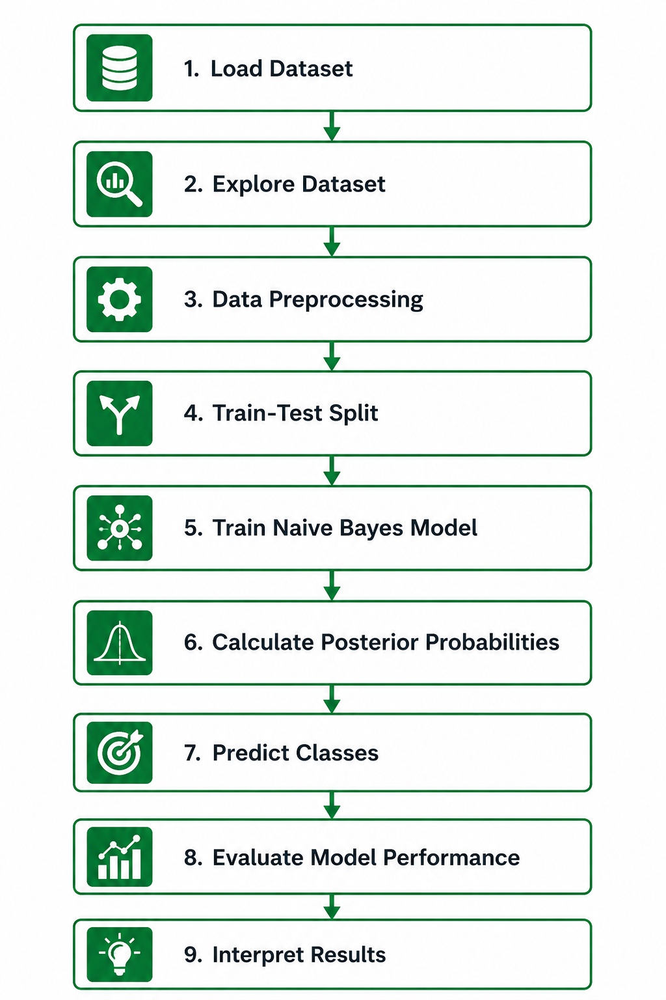

# 🧠 Naive Bayes Classifier — From Intuition to Implementation

> **ML Internship Project | Supervised Learning | Probabilistic Classification**
>
> *Authored in the spirit of FAANG-level engineering and MIT-level pedagogy.*

---

## 📌 Introduction

Naive Bayes is one of the most elegant algorithms in machine learning — not because it is complex, but because it is surprisingly powerful despite being built on a beautifully simple idea: **probability**.

Unlike black-box models that learn through layers of transformations, Naive Bayes is fully transparent. You can trace every prediction back to a probability. This interpretability, combined with blazing-fast training and strong real-world performance, makes it a critical algorithm to understand — whether you're filtering your email inbox, diagnosing diseases, or preparing for a FAANG interview.

This repository contains:
- A conceptual deep-dive into Naive Bayes
- Mathematical formulation (final equations only, no derivations)
- A from-scratch NumPy implementation
- A Scikit-learn implementation
- Evaluation metrics, interview Q&A, and comparison with other algorithms
- A Jupyter Notebook using a **real Kaggle dataset** (no synthetic data)

---

## 🎯 Learning Objectives

By the end of this module, you will be able to:

- Explain Bayes' Theorem and its role in probabilistic classification
- Describe why the "naive" assumption exists and when it holds in practice
- Distinguish between Gaussian, Multinomial, and Bernoulli variants of Naive Bayes
- Implement Naive Bayes from scratch using NumPy
- Apply Naive Bayes using Scikit-learn on real-world data
- Identify common failure modes and how to address them
- Answer top Naive Bayes interview questions with confidence

---

## 🤔 What is Naive Bayes?

Naive Bayes is a **probabilistic supervised classification algorithm** based on Bayes' Theorem. Given a set of features describing a data point, it computes the probability that the point belongs to each possible class — and assigns the class with the highest probability.

Think of it as a **doctor making a diagnosis**. A patient comes in with symptoms: fever, cough, and fatigue. The doctor doesn't run every test in the world. Instead, she uses prior medical knowledge — *"How often does this combination of symptoms appear in flu patients versus COVID patients?"* — and makes a probabilistic judgment.

That's Naive Bayes. It asks: **Given these features, which class is most probable?**

---

## 😶 Why is it Called "Naive"?

The algorithm earns the label "naive" because it makes a strong simplifying assumption: **all features are conditionally independent of each other, given the class label.**

In plain English: once you know the class, the features don't influence one another.

**Example:** In spam detection, the algorithm assumes that the presence of the word *"free"* in an email is independent of the presence of the word *"money"* — given that the email is spam. In reality, these words often co-occur. That's the "naivety."

Yet despite violating this assumption almost universally in real data, Naive Bayes often performs remarkably well. This is because for **classification** (not probability estimation), we only need to know *which class has the highest probability*, not the exact probability values. The naivety biases all classes equally, and the ranking often remains correct.

**The lesson for interviews:** When someone challenges Naive Bayes for its unrealistic assumption, the right response is not to defend the assumption — it's to explain *why the algorithm works anyway*.

---

## 🌍 Real-World Applications

| Domain | Application |
|---|---|
| **Email Filtering** | Classifying emails as spam or not spam |
| **Healthcare** | Predicting disease likelihood from patient symptoms |
| **Sentiment Analysis** | Categorizing product reviews as positive/negative |
| **Document Classification** | Routing support tickets to the correct department |
| **Fraud Detection** | Flagging suspicious transactions |
| **News Categorization** | Tagging articles as sports, politics, tech, etc. |
| **Medical Imaging** | First-pass triage classifiers for abnormality detection |

**Healthcare Example:** A hospital system uses Naive Bayes to triage incoming patients based on vital signs (heart rate, blood pressure, temperature, oxygen saturation). Given a patient's readings, the model estimates the probability of conditions such as sepsis, cardiac event, or stable status — helping prioritize care. Because the algorithm is interpretable, doctors can verify *why* a patient was flagged, which is critical in clinical environments.

**Spam Detection Example:** Gmail-style spam filters use variants of Naive Bayes (especially Multinomial NB) to classify emails. Each word in an email is treated as a feature. The model learns that emails with words like *"Congratulations," "winner," "claim your prize"* have high conditional probability under the spam class. New emails are scored in milliseconds — even at billions of emails per day.

---

## 🧱 Core Concepts and Intuition

### Prior Probability
This is what you believe *before* seeing any data. If 30% of all emails in your training set are spam, then P(Spam) = 0.30. This is your starting belief.

### Likelihood
This captures how probable the observed features are, *given* a specific class. If the word "free" appears in 80% of spam emails but only 5% of non-spam emails, it's a strong signal.

### Posterior Probability
This is what you believe *after* seeing the data. It updates your prior using the evidence (the features). The class with the highest posterior is chosen as the prediction.

### Bayes' Theorem ties all three together:
> Posterior ∝ Likelihood × Prior

---

## 📐 Bayes' Theorem and Mathematical Formulation

### Core Theorem

$$P(C_k \mid \mathbf{x}) = \frac{P(\mathbf{x} \mid C_k) \cdot P(C_k)}{P(\mathbf{x})}$$

**Symbol Explanations:**

| Symbol | Meaning |
|---|---|
| `P(Cₖ \| x)` | **Posterior** — Probability of class *k* given observed features **x** |
| `P(x \| Cₖ)` | **Likelihood** — Probability of observing features **x** assuming class *k* |
| `P(Cₖ)` | **Prior** — Probability of class *k* before seeing any features |
| `P(x)` | **Evidence** — Total probability of observing **x** across all classes (a normalizing constant) |

Since P(**x**) is the same for all classes, it can be dropped when comparing:

$$\hat{y} = \arg\max_{k} \; P(C_k) \cdot \prod_{i=1}^{n} P(x_i \mid C_k)$$

**Symbol Explanations:**

| Symbol | Meaning |
|---|---|
| `ŷ` | Predicted class label |
| `argmax_k` | Choose the class *k* that maximizes the expression |
| `P(Cₖ)` | Prior probability of class *k* |
| `∏` | Product over all *n* features |
| `P(xᵢ \| Cₖ)` | Likelihood of feature *i* given class *k* |
| `n` | Number of features |

### Log-Space Formulation (Numerically Stable)

$$\hat{y} = \arg\max_{k} \left[ \log P(C_k) + \sum_{i=1}^{n} \log P(x_i \mid C_k) \right]$$

**Why log space?** Multiplying many small probabilities causes **numerical underflow** (the product becomes indistinguishable from zero in floating-point arithmetic). Taking the log converts products into sums — mathematically equivalent but numerically stable.

---

## 🔗 Conditional Probability

Conditional probability is the backbone of Naive Bayes. It asks: *"What is the probability of event A, knowing that event B has already occurred?"*

$$P(A \mid B) = \frac{P(A \cap B)}{P(B)}$$

**Symbol Explanations:**

| Symbol | Meaning |
|---|---|
| `P(A \| B)` | Probability of A given B has occurred |
| `P(A ∩ B)` | Joint probability of both A and B occurring |
| `P(B)` | Probability of B (must be > 0) |

**Intuition:** Suppose 1% of the population has a rare disease. A test for the disease has 99% accuracy. If you test positive, what is the probability you actually have the disease? The intuitive answer is "99%." The correct answer, using conditional probability and Bayes' Theorem, is much lower — often around 50% — because the base rate (prior) of the disease is very low. This is called the **base rate fallacy**, and Naive Bayes correctly accounts for it through the prior term.

---

## 🗂️ Types of Naive Bayes

### 1. Gaussian Naive Bayes

**Use when:** Features are continuous and approximately normally distributed.

**Assumption:** Within each class, each feature follows a Gaussian (normal) distribution.

$$P(x_i \mid C_k) = \frac{1}{\sqrt{2\pi\sigma_{k,i}^2}} \exp\left(-\frac{(x_i - \mu_{k,i})^2}{2\sigma_{k,i}^2}\right)$$

**Symbol Explanations:**

| Symbol | Meaning |
|---|---|
| `μₖ,ᵢ` | Mean of feature *i* for class *k* (learned from training data) |
| `σ²ₖ,ᵢ` | Variance of feature *i* for class *k* (learned from training data) |
| `xᵢ` | Observed value of feature *i* |
| `exp(·)` | Exponential function |
| `π` | Mathematical constant pi (~3.14159) |

**Real-world example:** Predicting whether a patient has diabetes based on continuous features like glucose level, BMI, and age. Each feature's distribution is modeled per class (diabetic / non-diabetic).

---

### 2. Multinomial Naive Bayes

**Use when:** Features represent counts or frequencies (e.g., word counts in a document).

**Assumption:** Features are generated from a multinomial distribution.

$$P(x_i \mid C_k) = \frac{N_{k,i} + \alpha}{N_k + \alpha \cdot V}$$

**Symbol Explanations:**

| Symbol | Meaning |
|---|---|
| `Nₖ,ᵢ` | Count of feature *i* appearing in training samples of class *k* |
| `Nₖ` | Total count of all features in class *k* |
| `α` | Laplace smoothing parameter (typically 1) to avoid zero probabilities |
| `V` | Vocabulary size (total number of unique features) |

**Real-world example:** Classifying news articles (sports, politics, technology) based on word frequencies. The word "quarterback" is far more probable in sports articles; "legislation" more probable in political ones.

---

### 3. Bernoulli Naive Bayes

**Use when:** Features are binary (0 or 1) — feature is either present or absent.

**Assumption:** Each feature is generated from an independent Bernoulli distribution.

$$P(x_i \mid C_k) = P(i \mid C_k) \cdot x_i + (1 - P(i \mid C_k)) \cdot (1 - x_i)$$

**Symbol Explanations:**

| Symbol | Meaning |
|---|---|
| `P(i \| Cₖ)` | Probability that feature *i* is present (= 1) in class *k* |
| `xᵢ` | Binary value of feature *i* (0 or 1) |

**Key difference from Multinomial NB:** Bernoulli NB explicitly penalizes the *absence* of a feature, while Multinomial NB only considers counts of features present. This makes Bernoulli NB better for short texts where the non-occurrence of words carries signal.

**Real-world example:** Short-text spam detection where features indicate whether certain keywords appear (1) or don't (0) in a message.

---

## ⚠️ Assumptions of Naive Bayes

1. **Conditional Feature Independence:** Given the class label, all features are assumed to be mutually independent. This is the "naive" assumption and is almost always violated in practice.

2. **Feature Relevance:** All features are assumed to contribute to the prediction. Irrelevant features add noise but do not break the model.

3. **Distribution Assumption:** Each variant of Naive Bayes assumes a specific distribution for the likelihood (Gaussian, Multinomial, or Bernoulli). Violating this can degrade performance.

4. **Sufficient Training Data per Class:** Class-conditional probabilities must be estimated from data. Rare classes with few training examples yield unreliable estimates.

5. **No Missing Features at Prediction Time:** The model needs feature values to compute likelihoods. Missing values require imputation or special handling.

---

## 🔄 Step-by-Step Working of the Algorithm

### Training Phase

**Step 1 — Calculate Prior Probabilities**
For each class, compute the fraction of training samples belonging to that class.

**Step 2 — Calculate Likelihoods**
For each feature and each class, estimate the conditional probability (or the distribution parameters, in the case of Gaussian NB).

**Step 3 — Apply Laplace Smoothing (for discrete features)**
Add a small constant to all counts to prevent zero probabilities from zeroing out the entire product.

### Prediction Phase

**Step 4 — Compute Log-Posterior for Each Class**
For a new sample, compute `log P(Cₖ) + Σ log P(xᵢ | Cₖ)` for every class.

**Step 5 — Assign the Class with Maximum Posterior**
The class with the highest log-posterior score is the predicted label.

**Step 6 — Return Probabilities (Optional)**
If probability estimates are needed, apply the softmax function or normalize the raw posteriors across classes.

---

## ⚖️ Advantages and Limitations

### Advantages

- **Extremely fast** to train and predict — O(n·d) training time where *n* is samples and *d* is features
- **Works well with small datasets** — fewer parameters to estimate than discriminative models
- **Handles high-dimensional data** gracefully — performs well in NLP with thousands of features
- **Naturally multi-class** — no modification needed for problems with more than two classes
- **Interpretable** — every prediction is traceable through probability tables
- **Robust to irrelevant features** — irrelevant features contribute uniform likelihoods across classes

### Limitations

- **Strong independence assumption** — feature correlations are ignored entirely
- **Poor probability calibration** — predicted class probabilities are often over-confident or poorly scaled
- **Zero frequency problem** — unseen feature-class combinations yield zero probability (mitigated by Laplace smoothing)
- **Continuous features require distribution assumptions** — Gaussian NB can fail if the true distribution is skewed or multimodal
- **Feature interactions are invisible** — the model cannot capture that "not spam" AND "free money" together is a stronger signal than either alone

---

## 🥊 Naive Bayes vs Logistic Regression

| Dimension | Naive Bayes | Logistic Regression |
|---|---|---|
| **Type** | Generative model | Discriminative model |
| **What it learns** | Joint distribution P(x, y) | Decision boundary P(y\|x) directly |
| **Independence assumption** | Yes — features assumed independent | No |
| **Training data needed** | Very small datasets work | Needs more data to converge |
| **Training speed** | Extremely fast (closed-form) | Iterative optimization (gradient descent) |
| **Prediction speed** | Very fast | Very fast |
| **Performance with many features** | Strong (especially in NLP) | Can struggle without regularization |
| **Feature correlations** | Ignored | Handled implicitly |
| **Interpretability** | Probability tables | Coefficients (weights per feature) |
| **Best for** | Text classification, small data | Tabular data, when calibrated probabilities matter |

**Key insight for interviews:** Logistic Regression is often more accurate when sufficient data is available because it doesn't make the independence assumption. But Naive Bayes can outperform Logistic Regression in **high-dimensional, sparse settings** (like bag-of-words text) — where the independence assumption, while wrong, is close enough to right.

---

## 🥊 Naive Bayes vs K-Nearest Neighbors

| Dimension | Naive Bayes | K-Nearest Neighbors (KNN) |
|---|---|---|
| **Approach** | Probabilistic (model-based) | Instance-based (lazy learner) |
| **Training time** | O(n · d) — very fast | O(1) — no training |
| **Prediction time** | O(d) — very fast | O(n · d) — slow for large datasets |
| **Memory** | Stores only summary statistics | Stores entire training dataset |
| **Feature scaling needed** | No | Yes (distances are scale-sensitive) |
| **Handles high dimensions** | Well | Poorly (curse of dimensionality) |
| **Interpretability** | High (probability-based) | Medium (nearest neighbors are traceable) |
| **Missing data tolerance** | Moderate | Low |
| **Best for** | Text data, real-time inference | Small datasets, non-linear boundaries |

**Key insight for interviews:** KNN has no training phase but pays at prediction time — it must scan the entire training set for every new prediction. Naive Bayes inverts this: training computes statistics once, and prediction is near-instantaneous. For production systems serving millions of predictions per second, Naive Bayes is often preferred for its speed.

---

## 🔢 Handling Continuous and Categorical Features

### Continuous Features
Use **Gaussian Naive Bayes**: estimate the mean and variance of each feature per class during training, then plug into the Gaussian PDF formula at prediction time.

**Caveat:** If a feature is heavily skewed (e.g., income distribution), consider log-transforming it before applying Gaussian NB. Alternatively, **discretize** the continuous feature into bins and use Multinomial NB.

### Categorical Features
Use **Multinomial or Bernoulli Naive Bayes**: estimate the frequency (or binary presence) of each category per class.

**Caveat:** If a category value appears at test time but was never seen in training for a given class, the likelihood becomes zero — collapsing the entire posterior. Apply **Laplace smoothing** (add-α smoothing) to prevent this.

### Mixed Features
Scikit-learn does not natively support mixed feature types in a single Naive Bayes estimator. Common approaches:
- Segment features by type, compute likelihoods separately, and combine log-posteriors manually
- Use **CategoricalNB** for categorical features alongside **GaussianNB** for continuous features in a custom pipeline

---

## 🚧 Practical Challenges and Common Failure Modes

### 1. Zero Probability (Zero-Frequency Problem)
If a feature value never co-occurs with a class in training data, P(xᵢ | Cₖ) = 0, and the entire posterior becomes zero. **Fix:** Apply Laplace (add-1) smoothing or add-α smoothing.

### 2. Correlated Features
When features are correlated (e.g., "chest pain" and "shortness of breath" in a cardiac dataset), Naive Bayes double-counts their evidence. **Fix:** Feature selection or PCA to decorrelate features before applying the model.

### 3. Imbalanced Classes
If one class heavily dominates, the high prior can overwhelm weak likelihoods, biasing predictions toward the majority class. **Fix:** Resampling (SMOTE, undersampling), adjusting class priors, or using evaluation metrics robust to imbalance (F1, AUC-ROC).

### 4. Out-of-Vocabulary Features at Test Time
In text classification, unseen words at prediction time cause likelihood estimation to fail. **Fix:** Laplace smoothing and vocabulary pruning (ignore rare words).

### 5. Poor Probability Calibration
Naive Bayes is known to produce extreme probability estimates (close to 0 or 1) due to the independence assumption amplifying confidence. **Fix:** Apply **Platt scaling** or **isotonic regression** post-training for calibrated probabilities when you need reliable confidence scores.

---

## 💻 Implementation Overview

### From Scratch using NumPy

```python
import numpy as np

class GaussianNaiveBayes:
    def fit(self, X, y):
        self.classes = np.unique(y)
        self.priors = {}
        self.means = {}
        self.variances = {}

        for c in self.classes:
            X_c = X[y == c]
            self.priors[c] = len(X_c) / len(X)
            self.means[c] = X_c.mean(axis=0)
            self.variances[c] = X_c.var(axis=0) + 1e-9  # stability term

    def _log_likelihood(self, x, mean, var):
        return -0.5 * np.sum(np.log(2 * np.pi * var) + ((x - mean) ** 2) / var)

    def predict(self, X):
        predictions = []
        for x in X:
            log_posteriors = {}
            for c in self.classes:
                log_prior = np.log(self.priors[c])
                log_likelihood = self._log_likelihood(x, self.means[c], self.variances[c])
                log_posteriors[c] = log_prior + log_likelihood
            predictions.append(max(log_posteriors, key=log_posteriors.get))
        return np.array(predictions)
```

Key design decisions:
- Log-space arithmetic prevents underflow
- A small epsilon (`1e-9`) is added to variances for numerical stability
- Training computes per-class statistics; prediction applies the MAP decision rule

---

### Using Scikit-learn

```python
from sklearn.naive_bayes import GaussianNB, MultinomialNB, BernoulliNB
from sklearn.model_selection import train_test_split
from sklearn.metrics import classification_report, confusion_matrix
from sklearn.preprocessing import StandardScaler
import pandas as pd

# Load real Kaggle dataset (e.g., Pima Indians Diabetes Dataset)
df = pd.read_csv("diabetes.csv")
X = df.drop("Outcome", axis=1).values
y = df["Outcome"].values

X_train, X_test, y_train, y_test = train_test_split(X, y, test_size=0.2, random_state=42)

# Gaussian NB for continuous features
model = GaussianNB(var_smoothing=1e-9)
model.fit(X_train, y_train)
y_pred = model.predict(X_test)

print(classification_report(y_test, y_pred))
print(confusion_matrix(y_test, y_pred))

# For text data — Multinomial NB
# from sklearn.feature_extraction.text import CountVectorizer
# vectorizer = CountVectorizer()
# X_counts = vectorizer.fit_transform(corpus)
# model_mnb = MultinomialNB(alpha=1.0)  # alpha = Laplace smoothing
# model_mnb.fit(X_counts, labels)
```

> **Note on Dataset:** The Jupyter Notebook accompanying this repository uses a **real Kaggle dataset** — no synthetic data is used at any point. Real datasets introduce genuine challenges (class imbalance, missing values, non-Gaussian distributions) that synthetic data conceals.

---

## 📊 Evaluation Metrics for Classification

| Metric | Formula | When to Use |
|---|---|---|
| **Accuracy** | (TP + TN) / Total | Balanced classes |
| **Precision** | TP / (TP + FP) | Cost of false positives is high (e.g., spam filter) |
| **Recall (Sensitivity)** | TP / (TP + FN) | Cost of false negatives is high (e.g., disease diagnosis) |
| **F1 Score** | 2 · (Precision · Recall) / (Precision + Recall) | Imbalanced classes |
| **AUC-ROC** | Area under ROC curve | Ranking quality across thresholds |
| **Log Loss** | −(1/n)Σ[y·log(ŷ) + (1−y)·log(1−ŷ)] | When calibrated probabilities matter |

**Healthcare context:** In a cancer screening classifier, **Recall** is paramount — missing a true positive (a patient who has cancer) is far costlier than a false alarm. Naive Bayes's log-posterior scores can be threshold-tuned to trade precision for recall.

**Confusion Matrix** is always your first diagnostic tool. It reveals whether errors are symmetric (equally wrong in both directions) or asymmetric (biased toward one type of error).

---

## ⚙️ Hyperparameters and Their Significance

### `var_smoothing` (GaussianNB)
- **What it does:** Adds a fraction of the largest variance in the training data to all variances, preventing division by zero
- **Default:** `1e-9`
- **Tuning:** Increase if features have very small variance; too large a value shrinks all class distributions toward a common variance

### `alpha` (MultinomialNB and BernoulliNB)
- **What it does:** Laplace smoothing parameter — adds α pseudo-counts to every feature-class combination
- **Default:** `1.0` (Laplace smoothing); `0` disables smoothing
- **Tuning:** Values between 0.1 and 2.0 are common; tune via cross-validation. Too large an α over-smooths and ignores the data; too small risks zero probabilities

### `fit_prior` (All variants)
- **What it does:** Whether to learn class priors from training data or assume uniform priors
- **Default:** `True`
- **When to set False:** When you know the true class distribution differs from the training set (e.g., artificially balanced training data for an imbalanced real-world problem)

### `class_prior` (All variants)
- **What it does:** Allows you to manually specify prior probabilities per class
- **Use case:** When you have domain knowledge about the real-world class distribution that isn't reflected in your training sample

---

## 🎤 Top 5 Interview Questions with Answers

---

**Q1: Why does Naive Bayes work well in practice despite the independence assumption being wrong?**

**A:** The independence assumption biases the likelihood estimates for all classes in a similar direction. Since classification only requires *ranking* the posterior probabilities (not computing exact values), correlated features affect all classes roughly equally — preserving the correct ranking. Additionally, in high-dimensional spaces, the model's simplicity is a regularizer: fewer parameters means less overfitting, which often outweighs the bias from the independence assumption.

---

**Q2: What is Laplace smoothing and why is it necessary?**

**A:** Laplace smoothing adds a small pseudo-count α (typically 1) to every feature-class count before computing probabilities. Without it, if a feature value never appears with a given class in training, P(xᵢ | Cₖ) = 0, and the product rule zeros out the entire posterior for that class — regardless of how strong the other features are. Smoothing ensures no probability is exactly zero while shifting estimates toward a uniform distribution proportionally to how much data you have (more data = smaller relative impact of smoothing).

---

**Q3: When would you choose Naive Bayes over Logistic Regression?**

**A:** Choose Naive Bayes when: (1) Training data is small — Naive Bayes converges faster with less data because it estimates fewer parameters. (2) You need real-time predictions — training is essentially a statistics computation, and prediction is just a few multiplications. (3) Features are mostly independent — text bag-of-words features are a good approximation. (4) The problem is high-dimensional and sparse — Multinomial NB is exceptionally well-suited for NLP tasks. Choose Logistic Regression when you have sufficient data, need calibrated probability outputs, or when feature correlations are strong and important.

---

**Q4: What is the difference between Multinomial NB and Bernoulli NB?**

**A:** Both handle discrete features, but they differ in what they model. Multinomial NB models *how many times* a feature occurs — it uses word counts or term frequencies and ignores words that don't appear. Bernoulli NB models *whether or not* a feature is present — it uses binary indicators and explicitly penalizes the absence of features. For short texts, Bernoulli NB often outperforms Multinomial NB because the non-occurrence of discriminative words is itself informative. For longer documents where frequency matters, Multinomial NB is preferred.

---

**Q5: How does Naive Bayes handle the zero-frequency problem in production?**

**A:** In production text classifiers, encountering words not seen during training is inevitable. Without smoothing, the entire posterior collapses to zero. The standard fix is Laplace (add-1) or add-α smoothing, which assigns a small non-zero probability to all feature-class pairs — including unseen ones. For very large vocabularies, additional techniques include vocabulary pruning (ignore words appearing fewer than *k* times in training), out-of-vocabulary token handling (map rare/unseen words to a special `<UNK>` token), and back-off models that fall back to lower-order statistics when higher-order ones are unavailable.

---

## 📚 Prerequisites Required Before Learning Naive Bayes

Before diving into Naive Bayes, ensure you are comfortable with:

- **Basic Probability Theory** — events, sample spaces, probability rules
- **Conditional Probability** — P(A|B), the multiplication rule
- **Bayes' Theorem** — derivation and intuition (even if you don't use the derivation in NB)
- **Probability Distributions** — Gaussian (normal), Multinomial, Bernoulli
- **Python and NumPy** — array operations, vectorized computation
- **Pandas** — data loading, cleaning, and preprocessing
- **Supervised Learning Fundamentals** — train/test split, overfitting, evaluation metrics
- **Scikit-learn API** — fit, predict, transform paradigm

---

## 🔗 Connections to Other Machine Learning Algorithms

| Algorithm | Relationship to Naive Bayes |
|---|---|
| **Logistic Regression** | The discriminative counterpart — models P(y\|x) directly instead of modeling the joint P(x,y) |
| **Linear Discriminant Analysis (LDA)** | Also a generative model; assumes features are jointly Gaussian (vs. independently Gaussian in NB) |
| **Decision Trees** | Also handles feature interactions; no independence assumption; better with correlated features |
| **Hidden Markov Models (HMMs)** | Extension of NB to sequential data — NB can be seen as a single-state HMM |
| **Bayesian Networks** | Generalization of NB that models *dependencies* between features as a directed graph |
| **Text Vectorization (TF-IDF)** | Often used as a preprocessing step before applying Multinomial NB in NLP pipelines |

---

## 📋 Quick Revision Table

| Concept | Key Point |
|---|---|
| Naive Bayes type | Probabilistic, generative classifier |
| Core equation | Posterior ∝ Likelihood × Prior |
| "Naive" assumption | Features are conditionally independent given class |
| Gaussian NB | Continuous features; estimates mean and variance per class |
| Multinomial NB | Count/frequency features; used in NLP |
| Bernoulli NB | Binary features; penalizes absence of features |
| Laplace smoothing | Prevents zero-probability by adding pseudo-counts |
| Log-space computation | Prevents numerical underflow from multiplying small probabilities |
| Training complexity | O(n × d) — very fast |
| Prediction complexity | O(d × C) — near-instant |
| Key hyperparameter | `alpha` (smoothing), `var_smoothing`, `fit_prior` |
| Main weakness | Correlated features, poor probability calibration |
| Best use case | Text classification, small datasets, high-dimensional sparse data |
| vs Logistic Regression | NB is generative; LR is discriminative; NB wins with small data |
| vs KNN | NB is faster at prediction; KNN is lazy but accurate on small data |

---

## ✅ Key Takeaways

- Naive Bayes computes the probability of each class given the input features and selects the most probable class — this is the MAP (Maximum A Posteriori) decision rule.
- The "naive" conditional independence assumption is almost always violated, yet the algorithm works because classification requires only the correct *ranking* of posteriors, not exact probability values.
- Three variants exist for different data types: Gaussian (continuous), Multinomial (counts), Bernoulli (binary). Choosing the wrong variant for your data type is a common production mistake.
- Laplace smoothing is not optional in practice — it must be applied to all discrete Naive Bayes variants to handle unseen feature values in production.
- For real-time, high-volume prediction systems (email filtering, fraud detection, medical triage), Naive Bayes is difficult to beat on speed and simplicity.
- Understanding Naive Bayes deeply also prepares you to understand Bayesian Networks, Hidden Markov Models, and the generative/discriminative distinction — all high-value interview topics.

---

## 🔄 Workflow Diagram



---

## 📖 References and Further Reading

- **Bishop, C. M.** (2006). *Pattern Recognition and Machine Learning*. Springer. — Chapter 4 covers probabilistic generative models including Naive Bayes.
- **Murphy, K. P.** (2012). *Machine Learning: A Probabilistic Perspective*. MIT Press. — Comprehensive coverage of generative classifiers and Bayesian methods.
- **Hastie, T., Tibshirani, R., & Friedman, J.** (2009). *The Elements of Statistical Learning* (2nd ed.). Springer. — Chapter 6 covers kernel methods and density estimation underlying Gaussian NB.
- **Scikit-learn Documentation — Naive Bayes:** https://scikit-learn.org/stable/modules/naive_bayes.html
- **Manning, C., Raghavan, P., & Schütze, H.** (2008). *Introduction to Information Retrieval*. Cambridge University Press. — Chapter 13 is the gold standard for Naive Bayes in text classification.
- **Rish, I.** (2001). *An Empirical Study of the Naive Bayes Classifier.* IBM Research Report. — The definitive empirical paper explaining why Naive Bayes works despite false independence assumptions.
- **Kaggle Datasets used in this project:**
  - [Pima Indians Diabetes Dataset](https://www.kaggle.com/datasets/uciml/pima-indians-diabetes-database) — for Gaussian NB
  - [SMS Spam Collection Dataset](https://www.kaggle.com/datasets/uciml/sms-spam-collection-dataset) — for Multinomial and Bernoulli NB

---

*This README was authored as part of an ML Internship project with the goal of making probabilistic machine learning accessible, interview-ready, and production-aware. All implementations use real Kaggle datasets — because real data teaches what synthetic data hides.*
