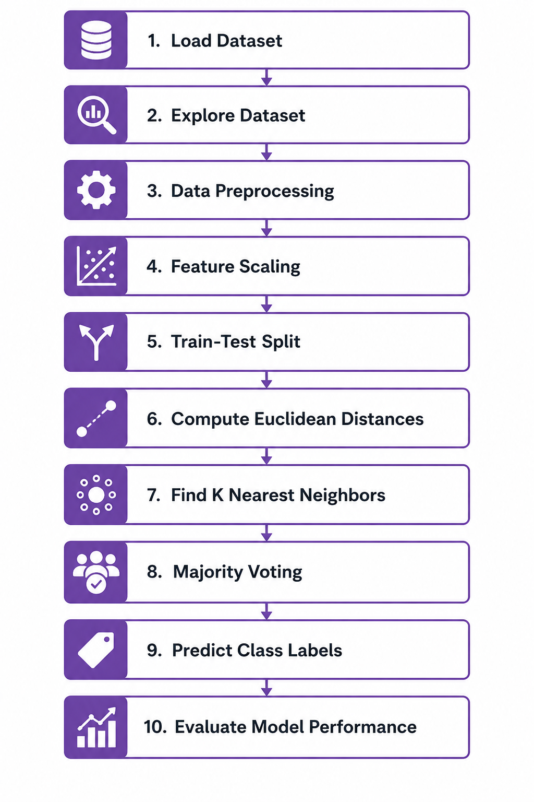

# K-Nearest Neighbors (KNN) — ML Internship Module

> **"Tell me who your neighbors are, and I'll tell you who you are."**
> — The core philosophy of K-Nearest Neighbors

---

## Table of Contents

1. [Introduction](#1-introduction)
2. [Learning Objectives](#2-learning-objectives)
3. [What is K-Nearest Neighbors (KNN)?](#3-what-is-k-nearest-neighbors-knn)
4. [Real-World Applications](#4-real-world-applications)
5. [Core Concepts and Intuition](#5-core-concepts-and-intuition)
6. [Distance Metrics and Mathematical Formulation](#6-distance-metrics-and-mathematical-formulation)
7. [Step-by-Step Working of KNN](#7-step-by-step-working-of-knn)
8. [Choosing the Optimal Value of K](#8-choosing-the-optimal-value-of-k)
9. [Importance of Feature Scaling](#9-importance-of-feature-scaling)
10. [Curse of Dimensionality](#10-curse-of-dimensionality)
11. [Advantages and Limitations](#11-advantages-and-limitations)
12. [KNN vs Logistic Regression](#12-knn-vs-logistic-regression)
13. [KNN vs Naive Bayes](#13-knn-vs-naive-bayes)
14. [Practical Challenges and Common Failure Modes](#14-practical-challenges-and-common-failure-modes)
15. [Implementation Overview](#15-implementation-overview)
16. [Evaluation Metrics for Classification](#16-evaluation-metrics-for-classification)
17. [Hyperparameters and Their Significance](#17-hyperparameters-and-their-significance)
18. [Top 5 Interview Questions with Answers](#18-top-5-interview-questions-with-answers)
19. [Prerequisites Required Before Learning KNN](#19-prerequisites-required-before-learning-knn)
20. [Connections to Other Machine Learning Algorithms](#20-connections-to-other-machine-learning-algorithms)
21. [Quick Revision Table](#21-quick-revision-table)
22. [Key Takeaways](#22-key-takeaways)
23. [Dataset Used in Implementation](#23-dataset-used-in-implementation)
24. [Workflow Diagram](#24-workflow-diagram)
25. [References and Further Reading](#25-references-and-further-reading)

---

## 1. Introduction

This repository is part of an ML Internship program designed to build a deep, interview-ready understanding of foundational machine learning algorithms. This module covers **K-Nearest Neighbors (KNN)** — one of the oldest, most intuitive, and most instructive algorithms in all of supervised machine learning.

KNN is not just a beginner's toy. It is a production tool used in recommendation systems (Spotify, Amazon), healthcare diagnosis, anomaly detection, and the foundation upon which approximate nearest neighbor systems like **FAISS** (Meta) and **ScaNN** (Google) are built. Understanding KNN rigorously means understanding *distance-based reasoning* — a concept that runs through the entire field of machine learning.

**What makes this module unique:**
- All implementations use a **real Kaggle dataset** (Heart Disease Dataset) — no synthetic data.
- Concepts are explained with analogies and practical examples, then grounded in mathematics.
- Content is structured for both **beginners** and **FAANG interview candidates**.
- Two complete implementations are provided: **NumPy from scratch** and **Scikit-learn pipeline**.

---

## 2. Learning Objectives

By completing this module, you will be able to:

- Explain the KNN algorithm in plain English and with mathematical precision.
- Understand and apply Euclidean, Manhattan, and Minkowski distance metrics.
- Justify the choice of K using validation curves and cross-validation.
- Implement KNN from scratch using NumPy — without any ML library.
- Build a production-quality KNN pipeline using Scikit-learn with hyperparameter tuning.
- Apply KNN to a real Kaggle dataset and interpret evaluation metrics meaningfully.
- Identify exactly when and why KNN will fail (curse of dimensionality).
- Compare KNN to Logistic Regression and Naive Bayes across multiple practical dimensions.
- Answer the top KNN interview questions at FAANG-level technical depth.
- Recognize and correct the most common mistakes when implementing KNN.

---

## 3. What is K-Nearest Neighbors (KNN)?

K-Nearest Neighbors is a **non-parametric, instance-based, lazy supervised learning algorithm**. Let's unpack each of those terms, because they are all tested in interviews.

| Term | What It Means |
|---|---|
| **Non-parametric** | KNN makes no assumptions about the shape of the decision boundary or the distribution of data. It does not fit a line, curve, or equation — it adapts to whatever pattern is present in the data. |
| **Instance-based** | Instead of building a learned model from the training data, KNN stores the training data itself and uses it directly at prediction time. The data *is* the model. |
| **Lazy learner** | KNN performs zero computation during training. It simply stores the data and defers all computation to when a prediction is needed. |
| **Supervised** | KNN requires labeled training data — each training example has a known class label (for classification) or a numeric target (for regression). |

### How It Makes Predictions

**For Classification:** Find the K training examples closest to the new data point. Take a majority vote among their class labels. That majority class is the prediction.

**For Regression:** Find the K training examples closest to the new data point. Average their target values (optionally weighted by inverse distance). That average is the prediction.

### What KNN Is *Not*

- It is **not** a model in the traditional sense — there are no learned weights, coefficients, or parameters.
- The `fit()` call in Scikit-learn does not "train" anything — it merely stores the training data.
- It is **not** suitable for very large datasets without additional infrastructure (KD-trees, approximate nearest neighbor search).

### Key Terminology Glossary

| Term | Definition |
|---|---|
| **K** | The number of nearest neighbors to consider. The primary hyperparameter of KNN. |
| **Distance Metric** | The mathematical function used to measure "closeness" between two data points. |
| **Majority Vote** | The class label held by more than half of the K neighbors becomes the prediction. |
| **Decision Boundary** | The imaginary boundary in feature space that separates predicted classes. KNN's boundary can take any shape. |

---

## 4. Real-World Applications

KNN and distance-based reasoning are more widespread in production systems than most beginners realize.

### Healthcare — Disease Diagnosis *(Primary Application in This Module)*

A cardiologist treating a new patient does not always derive a formula from scratch. She recalls previous patients with similar age, blood pressure, cholesterol, and chest pain characteristics and infers a likely diagnosis. This is exactly KNN. In this module, we apply KNN to the **Heart Disease Dataset** to predict whether a patient is likely to have heart disease based on clinical measurements. Similar approaches are used in hospitals to triage patients and flag high-risk cases for follow-up.

### Fraud Detection in Banking

Fraudulent transactions tend to cluster tightly in feature space (unusual time, unusual merchant, unusual location). KNN can identify transactions with no legitimate close neighbors as anomalies. The premise: legitimate purchases look like other legitimate purchases. Fraud looks like nothing it has seen before.

### Recommendation Systems

Amazon's "Customers who bought this also bought..." and Spotify's music discovery both rely on user-similarity concepts rooted in nearest-neighbor thinking. If your listening history is similar to another user's (you are their nearest neighbor in listening-behavior space), their preferences are likely relevant to you.

### Image Recognition

KNN achieves around 97% accuracy on the MNIST handwritten digit dataset with K=3 and proper normalization — without any neural network. Pixel similarity often implies visual similarity for simple images.

### Anomaly Detection in Manufacturing

On a production line, sensors record readings for each unit produced. A trained KNN model defines what "normal" looks like. A new unit whose readings have no close neighbors in the training data is flagged as a potential defect.

### Bioinformatics — Tumor Classification

Gene expression profiles of tissue samples can be compared using KNN. Samples with similar expression profiles — neighboring points in gene-expression space — tend to carry similar diagnoses.

---

## 5. Core Concepts and Intuition

### The Governing Idea

KNN is built on one assumption: **similar things tend to belong to the same category**.

If two data points are close together in feature space, they probably share the same label. This is the local-similarity assumption — and it is remarkably powerful when it holds.

### Analogy 1 — Real Estate Pricing

Suppose you want to estimate the price of a house you're considering. You do not build a global model of the entire housing market. Instead, you look at the five most similar houses — same neighborhood, similar square footage, similar age — that sold recently, and you average their prices. That is KNN regression with K=5. You are reasoning from local examples, not from a global formula.

### Analogy 2 — Medical Diagnosis

A physician who has seen thousands of patients does not always write equations. She says: "The last seven patients with this exact combination of chest pain type, cholesterol level, and resting ECG pattern were all diagnosed with heart disease — so this patient likely has it too." That is KNN classification with K=7.

### Analogy 3 — Finding Your Neighborhood's Vibe

When you move to a new city and want to know what kind of neighborhood a given street belongs to, you don't study the entire city. You look at what's around you: the nearest coffee shops, parks, and establishments. Your street's character is defined by its immediate neighbors. Same idea.

### The Decision Boundary

Unlike Logistic Regression, which draws a straight line (or flat hyperplane) to separate classes, KNN draws a boundary that curves and adapts to the local density of training points.

- **K = 1:** The boundary hugs every individual training point. Maximally flexible, but also maximally sensitive to noise. Every outlier creates its own island in the decision map.
- **K = N (all training points):** Every new point is classified as the majority class in the training set, regardless of where it falls. Completely rigid.
- **Optimal K:** Somewhere in between, found through cross-validation.

**Visual Intuition:** Imagine your training data plotted on a 2D plane. For a new test point, draw an expanding circle until it touches exactly K training points. The majority label among those K points becomes the prediction. As K grows larger, the circle expands, more points are included, and predictions become smoother.

---

## 6. Distance Metrics and Mathematical Formulation

Distance metrics define what "nearest" means. Choosing the wrong metric for your data can silently destroy model performance — and this is a common interview and production pitfall.

### 6.1 Euclidean Distance (L2 Distance)

The straight-line (as-the-crow-flies) distance between two points in n-dimensional space. This is the default metric for KNN and works well for continuous features with similar scales.

$$d(p, q) = \sqrt{\sum_{i=1}^{n} (p_i - q_i)^2}$$

**Symbol Definitions:**

| Symbol | Meaning |
|---|---|
| `d(p, q)` | The Euclidean distance between points p and q |
| `p`, `q` | Two data points (vectors) in n-dimensional feature space |
| `p_i`, `q_i` | The value of the i-th feature of points p and q respectively |
| `n` | The number of features (dimensions) |
| `√(·)` | Square root function |
| `Σ` | Summation over all feature dimensions i from 1 to n |

**Worked Example:**
```
Patient A: [Cholesterol=200, Age=50, MaxHR=150]
Patient B: [Cholesterol=210, Age=55, MaxHR=140]

d(A, B) = √((210-200)² + (55-50)² + (140-150)²)
        = √(100 + 25 + 100)
        = √225
        = 15
```

**Significance:** Squaring the differences means Euclidean distance is more sensitive to large differences in any single feature. This is why feature scaling is non-negotiable — a feature with a large numerical range will dominate the distance if not standardized.

---

### 6.2 Manhattan Distance (L1 Distance / City Block Distance)

The sum of absolute differences along each dimension. Named after the grid-like street layout of Manhattan — you can only move along axes (north/south/east/west), never diagonally.

$$d(p, q) = \sum_{i=1}^{n} |p_i - q_i|$$

**Symbol Definitions:**

| Symbol | Meaning |
|---|---|
| `d(p, q)` | The Manhattan distance between points p and q |
| `p`, `q` | Two data points in n-dimensional feature space |
| `p_i`, `q_i` | The value of the i-th feature of points p and q |
| `\|·\|` | Absolute value — removes the sign of the difference |
| `n` | The number of features |

**Worked Example:**
```
Patient A: [Cholesterol=200, Age=50]
Patient B: [Cholesterol=210, Age=55]

d(A, B) = |210-200| + |55-50|
        = 10 + 5
        = 15
```

**Significance:** Because differences are not squared, Manhattan distance is less sensitive to outliers than Euclidean distance. It is generally preferred for high-dimensional data or when individual features can have extreme values. In a city grid analogy: Euclidean is flying directly to your destination; Manhattan is driving through the streets.

---

### 6.3 Minkowski Distance (Generalized Distance)

A unified framework that subsumes both Euclidean and Manhattan distance under a single parameterized formula. The parameter `r` controls which specific distance is computed.

$$d(x, y) = \left( \sum_{i=1}^{n} |x_i - y_i|^r \right)^{1/r}$$

**Symbol Definitions:**

| Symbol | Meaning |
|---|---|
| `d(x, y)` | The Minkowski distance between points x and y |
| `x`, `y` | Two data points in n-dimensional feature space |
| `x_i`, `y_i` | The value of the i-th feature of points x and y |
| `r` | The order parameter — a positive integer or real number that determines which distance is computed |
| `n` | The number of features |
| `\|·\|` | Absolute value |

**Special Cases:**

| Value of r | Resulting Metric |
|---|---|
| `r = 1` | Manhattan Distance (L1 norm) |
| `r = 2` | Euclidean Distance (L2 norm) — the default in Scikit-learn |
| `r → ∞` | Chebyshev Distance — the maximum absolute difference across any single dimension |

**Significance:** Minkowski distance gives you a continuous knob to tune the distance sensitivity. In Scikit-learn, `r` is exposed as the `p` parameter in `KNeighborsClassifier(metric='minkowski', p=2)`. This can itself be treated as a hyperparameter and tuned via cross-validation.

> **Interview Tip:** When asked about distance metrics, always mention all three — Euclidean, Manhattan, and Minkowski — and explain that Minkowski is the general form. Then briefly mention cosine similarity for text/NLP contexts and Hamming distance for binary/categorical features.

---

## 7. Step-by-Step Working of KNN

Let's trace through a complete example using a healthcare scenario. Suppose we have a training set of 500 patient records, each with two features: `[Cholesterol (mg/dL), Resting Heart Rate (bpm)]`, labeled `0 = No Heart Disease` or `1 = Heart Disease`. We set K = 5.

### Step 1 — Store the Training Data

KNN performs absolutely no computation during training.

```python
# This is the entire "training" step in KNN
knn.fit(X_train, y_train)
# Internally: self.X_train = X_train; self.y_train = y_train
```

This is what "lazy learning" means. The algorithm simply holds the training set in memory and waits.

### Step 2 — Receive a New Data Point

A new patient arrives with `x_new = [210, 72]` (cholesterol = 210 mg/dL, heart rate = 72 bpm).

### Step 3 — Compute Distances to All Training Points

For every one of the 500 training points, compute the Euclidean distance to `x_new`.

```
d(x_new, patient_1)  = √((210-205)² + (72-70)²) = √(25 + 4) ≈ 5.39
d(x_new, patient_2)  = √((210-180)² + (72-90)²) = √(900 + 324) ≈ 34.99
...  (repeated for all 500 training patients)
```

### Step 4 — Sort by Distance and Select the K Nearest Neighbors

Sort all 500 distances in ascending order. Select the top 5 (K=5) with smallest distances.

```
Rank 1: distance = 2.24,  label = 1  (Heart Disease)
Rank 2: distance = 3.61,  label = 1  (Heart Disease)
Rank 3: distance = 5.39,  label = 0  (No Heart Disease)
Rank 4: distance = 6.00,  label = 1  (Heart Disease)
Rank 5: distance = 7.81,  label = 0  (No Heart Disease)
```

### Step 5 — Majority Vote

Count the votes among the 5 nearest neighbors:
- Heart Disease (1): **3 votes**
- No Heart Disease (0): 2 votes

### Step 6 — Return the Prediction

```
Predicted Label:       1  (Heart Disease)
Predicted Probability: 3/5 = 0.60  (if soft prediction requested)
```

**For KNN Regression** (same steps, different aggregation at Step 5): Instead of voting, compute the mean of the neighbors' target values. If the 5 nearest neighbor houses had prices of `[₹85L, ₹90L, ₹87L, ₹92L, ₹88L]`, the predicted price would be their average: `₹88.4L`.

---

## 8. Choosing the Optimal Value of K

K is the single most important hyperparameter in KNN. Getting it wrong can completely ruin model performance.

### The Bias-Variance Tradeoff in K

| K Value | Bias | Variance | Description |
|---|---|---|---|
| K = 1 | Very Low | Very High | Memorizes training data; extremely sensitive to noise and outliers. Jagged, overfitted boundary. Training accuracy ≈ 100%; test accuracy may be poor. |
| K = 3 to 7 (small) | Low | Moderate-High | Responsive to local patterns; may still overfit in noisy regions. |
| **K = optimal** | **Balanced** | **Balanced** | Found via cross-validation. Best generalization on unseen data. |
| K = 50+ (large) | High | Low | Smooth, stable predictions but may miss local structure. |
| K = N | Maximum | Near Zero | Predicts the majority class for every single input. Useless classifier. |

### How to Find the Right K

**Method 1 — The Elbow Method:** Plot validation error on the y-axis against K values on the x-axis. Look for the "elbow" — the point where the error stops decreasing sharply and begins to plateau. This is the optimal K.

```python
import numpy as np
import matplotlib.pyplot as plt
from sklearn.neighbors import KNeighborsClassifier
from sklearn.model_selection import cross_val_score

k_values = range(1, 31, 2)  # Odd values only for binary classification
cv_scores = []

for k in k_values:
    knn = KNeighborsClassifier(n_neighbors=k)
    scores = cross_val_score(knn, X_train_scaled, y_train, cv=5, scoring='f1')
    cv_scores.append(scores.mean())

plt.plot(k_values, cv_scores, marker='o')
plt.xlabel('K (Number of Neighbors)')
plt.ylabel('Cross-Validated F1 Score')
plt.title('Elbow Method for Optimal K Selection')
plt.grid(True)
plt.show()
```

**Method 2 — Rule of Thumb:** Start with `K = √N_train`, where N_train is the number of training samples. For 700 training samples, start with K ≈ 26 and tune from there.

**Method 3 — GridSearchCV:** Use Scikit-learn's `GridSearchCV` to systematically search over a range of K values and select the best via cross-validation.

### Important Rules for Choosing K

- Always use **odd values of K** for binary classification to prevent ties in majority voting.
- Never deploy a **K = 1 model** in production without scrutiny — it almost always overfits.
- Use **cross-validation** (cv=5 or cv=10), not a single train/test split, for K selection.
- Consider **distance-weighted voting** (`weights='distance'`) when the optimal K seems sensitive to the exact value — it reduces tie issues and gives more influence to closer neighbors.

---

## 9. Importance of Feature Scaling

> **Feature scaling is not a best practice for KNN. It is a hard requirement. An unscaled KNN model is a broken KNN model.**

### Why Scaling Is Mandatory

KNN uses distance as its *sole* decision criterion. If features exist on different numerical scales, the feature with the largest range will dominate every distance calculation — regardless of how important (or unimportant) it actually is for prediction.

**Healthcare Example:**

Consider predicting heart disease with these features:

| Feature | Range |
|---|---|
| Cholesterol (mg/dL) | 100 — 600 |
| Resting Heart Rate (bpm) | 40 — 120 |
| Age (years) | 20 — 80 |
| Number of Major Vessels | 0 — 3 |

Without scaling, cholesterol differences dominate all distance calculations. Two patients with identical heart rates, ages, and vessel counts but a 50-point cholesterol difference will appear much farther apart than two patients with wildly different ages. The model will effectively ignore age and heart rate — the very features most clinically significant for heart disease.

### Two Standard Approaches

**Min-Max Normalization** — scales features to the range [0, 1]:

$$x_{\text{scaled}} = \frac{x - x_{\min}}{x_{\max} - x_{\min}}$$

| Symbol | Meaning |
|---|---|
| `x` | Original feature value |
| `x_min` | Minimum value of the feature in the **training set** |
| `x_max` | Maximum value of the feature in the **training set** |
| `x_scaled` | Normalized feature value, always in [0, 1] |

*Best for:* Features with known hard bounds (pixel intensity: 0–255, probability: 0–1). Sensitive to outliers.

---

**Standardization (Z-Score Normalization)** — scales to zero mean and unit variance:

$$x_{\text{scaled}} = \frac{x - \mu}{\sigma}$$

| Symbol | Meaning |
|---|---|
| `x` | Original feature value |
| `μ` | Mean of the feature in the **training set** |
| `σ` | Standard deviation of the feature in the **training set** |
| `x_scaled` | Standardized value, typically in the range [−3, 3] |

*Best for:* Most KNN applications. Robust to outliers. **Generally preferred for KNN.**

### The Golden Rule — Fit on Train, Transform Both

```python
from sklearn.preprocessing import StandardScaler

scaler = StandardScaler()

# FIT and TRANSFORM the training set
X_train_scaled = scaler.fit_transform(X_train)

# ONLY TRANSFORM the test set (never fit on it)
X_test_scaled = scaler.transform(X_test)
```

> **Why never fit on the test set?** If you compute the mean and standard deviation using the full dataset (including test data), you leak test-set information into the scaler. The model has now indirectly "seen" the test data during training — a form of data leakage that produces optimistically biased accuracy estimates.

---

## 10. Curse of Dimensionality

This is KNN's fundamental limitation, and **every FAANG-level ML interview involving KNN will probe this topic**. Understand it conceptually, mathematically, and practically.

### The Core Problem

In high-dimensional spaces, the concept of "nearest neighbor" breaks down. As the number of features (dimensions) grows, all data points become approximately equidistant from each other. When all pairwise distances converge to the same value, "nearest" has no meaningful interpretation — your K "nearest" neighbors are nearly as far away as the farthest point in the dataset.

### Geometric Intuition

Consider a unit hypercube (a cube where each side has length 1) in `d` dimensions. To capture a fraction `f` of the training data as the "local neighborhood" around a query point, the required side length `l` of that hypercube is:

$$l = f^{1/d}$$

| Symbol | Meaning |
|---|---|
| `l` | Required side length of the neighborhood hypercube |
| `f` | Fraction of total training data to include as neighbors (e.g., 0.01 for 1%) |
| `d` | Number of dimensions (features) |

**What this means in practice:**

| Dimensions (d) | Side Length (l) to capture 1% of data | Interpretation |
|---|---|---|
| 2 | `0.01^(1/2)` = 0.10 | Neighborhood spans 10% of each feature range |
| 10 | `0.01^(1/10)` = 0.63 | Neighborhood spans 63% of each feature range |
| 100 | `0.01^(1/100)` = 0.955 | Neighborhood spans **95.5%** of each feature range |

In 100 dimensions, finding just 1% of your training data as "neighbors" requires you to search 95.5% of the entire range of every single feature. The neighborhood is no longer local — it encompasses nearly the entire dataset. "Nearest" is meaningless.

### The Distance Concentration Phenomenon

In high-dimensional spaces, the ratio between the *maximum* and *minimum* pairwise distances among a set of random points approaches 1. All distances converge to the same value. KNN's predictions become arbitrary because every point is equally "nearest" — or equally "farthest".

### Practical Consequences

- Prediction accuracy degrades rapidly once the number of features exceeds roughly 20–30 for typical dataset sizes.
- The number of training samples needed to maintain meaningful local density grows *exponentially* with dimensionality.
- KNN essentially stops working as a meaningful classifier in truly high-dimensional settings.

### Solutions

- **Dimensionality Reduction:** Apply PCA, t-SNE, or UMAP before KNN to project data into a lower-dimensional space that preserves meaningful structure.
- **Feature Selection:** Remove irrelevant features. Every irrelevant feature adds pure noise to the distance calculation.
- **Switch to Manhattan Distance:** The L1 norm is less severely affected by dimensionality than Euclidean (L2) — use `p=1` in Minkowski distance.
- **Change the Algorithm:** For truly high-dimensional data (text, genomics), switch to Naive Bayes, SVM, or tree-based methods.

---

## 11. Advantages and Limitations

### Advantages

**Zero Training Time:** KNN's `fit()` call simply stores data — O(1) time. This is a real competitive advantage in scenarios where training data changes frequently. Online or streaming settings where you cannot afford to retrain a model benefit directly from this property.

**No Distribution Assumptions:** KNN is non-parametric. It never assumes linearity, normality, or any specific functional form. The decision boundary adapts to whatever local structure is present in the data.

**Native Multi-Class Support:** Majority voting works identically for 2, 5, or 100 classes. No architectural changes needed — unlike SVM, which requires one-vs-rest decomposition for multi-class problems.

**Transparency and Traceability:** Every prediction can be explained by pointing to the K specific training examples that influenced it. This makes KNN highly auditable, which matters in regulated domains like healthcare and finance.

**Instant Adaptation:** Adding a new training example requires no retraining. The new point is immediately considered in future neighbor searches.

### Limitations

**Slow Prediction at Scale:** Each prediction requires computing distance to all N training points — O(N × d) per prediction. With N = 1,000,000 training examples and d = 100 features, each prediction requires 100 million operations. Unacceptable for real-time systems without approximate methods.

**High Memory Requirement:** The entire training dataset must reside in memory at prediction time. A 10-million-row, 500-feature dataset cannot fit in RAM on a standard machine.

**Sensitive to Irrelevant Features:** All features contribute equally to distance by default. Irrelevant features inject noise into every distance calculation, pushing truly similar neighbors farther apart.

**Sensitive to Feature Scale:** Any feature with a larger numerical range will overpower the distance calculation. Feature scaling is non-negotiable.

**Degrades in High Dimensions:** The curse of dimensionality (Section 10) fundamentally limits KNN's effectiveness once features exceed ~20–30.

**Imbalanced Classes:** With K = 10 in a dataset that is 90% class A, most neighborhoods will be dominated by class A regardless of the true local distribution.

---

## 12. KNN vs Logistic Regression

| Dimension | KNN | Logistic Regression |
|---|---|---|
| Algorithm Type | Instance-based, lazy learner | Model-based, eager learner |
| Training Time | O(1) — stores data only | O(N × d × iterations) |
| Prediction Time | O(N × d) — slow at scale | O(d) — very fast |
| Memory at Inference | Stores all training data | Stores only d+1 parameters |
| Decision Boundary Shape | Non-linear, arbitrary shape | Linear only (hyperplane) |
| Feature Scaling Required | **Yes — critical** | Helps but not critical |
| Handles Non-linearity | Yes, naturally | No (requires feature engineering) |
| Probability Calibration | Poor (vote proportions only) | Excellent (sigmoid output) |
| Interpretability | Medium (traceable neighbors) | High (feature coefficients) |
| High-Dimensional Data | Degrades (curse of dimensionality) | Works well with regularization |
| Class Imbalance | Severely affected | Manageable with class weights |
| Best Use Case | Non-linear boundaries, small-to-medium datasets, continuous features | Linear separability, large-scale, calibrated probabilities required |

### Key Interview Insight

Logistic Regression produces a **global** linear decision boundary — it finds the single best hyperplane that separates all classes by learning from the entire dataset at once. KNN produces a **local**, non-linear boundary that adapts to the density of data in each region.

**When to choose KNN over Logistic Regression:** The true decision boundary is complex and non-linear, the dataset is small to medium, features are continuous and meaningful, and you do not need real-time prediction.

**When to choose Logistic Regression:** The data is approximately linearly separable, you need well-calibrated probabilities, the dataset is large, or prediction speed is critical.

---

## 13. KNN vs Naive Bayes

| Dimension | KNN | Naive Bayes |
|---|---|---|
| Algorithm Type | Instance-based, distance-based | Probabilistic, generative model |
| Training Time | O(1) | O(N × d) — fast |
| Prediction Time | O(N × d) — slow | O(d × C) — very fast (C = classes) |
| Memory | Stores all training data | Stores only summary statistics |
| Feature Independence Assumed | No | Yes — conditional independence assumption |
| Feature Scaling Required | **Yes — critical** | No |
| Handles Text / Sparse Data | Poorly | Excellently (Multinomial NB) |
| Probability Output Quality | Vote-based (poorly calibrated) | Native probability output |
| Handles Continuous Features | Naturally | Requires Gaussian NB assumption |
| Handles Categorical Features | Requires encoding | Naturally (Multinomial NB) |
| Performance in High Dimensions | Degrades significantly | Handles well |
| Data Requirements | Needs more data | Effective with very small datasets |
| Best Use Case | Continuous features, local patterns, non-linear boundaries | Text classification, small datasets, high-dimensional sparse data |

### Key Interview Insight

Naive Bayes generalizes from training statistics — it builds a compact global model (a set of probability tables). KNN memorizes training data and reasons locally at prediction time. Naive Bayes is computationally cheap and memory-efficient at prediction; KNN is expensive. For text classification, Naive Bayes almost always wins. For sensor data, medical measurements, or any setting with continuous features and local structure, KNN is often competitive.

---

## 14. Practical Challenges and Common Failure Modes

Understanding how KNN fails is as important as understanding how it works. These are the issues most commonly surfaced in technical interviews and real-world deployments.

**Not Scaling Features** — *The most common and most damaging mistake.* If StandardScaler is not in your KNN pipeline, your implementation is effectively broken. A feature with a range of 0–500 will completely overshadow a feature with a range of 0–1, regardless of their actual importance.

**Data Leakage from Scaler** — Fitting the scaler on the entire dataset (including test data) leaks test-set statistics into training. This produces suspiciously high accuracy that evaporates in production. Always fit the scaler only on training data.

**Choosing K = 1** — Almost always overfits. K = 1 memorizes training data perfectly, achieving near-100% training accuracy, but performs poorly on unseen examples. Never deploy K = 1 without strong justification.

**Using Even K for Binary Classification** — Even values can produce ties that require arbitrary tie-breaking. Always use odd K values (3, 5, 7, ...) for binary classification to guarantee a strict majority.

**Ignoring Dimensionality** — If your dataset has more than ~30 features, apply PCA or feature selection before KNN. High dimensionality makes distance meaningless.

**Confusing KNN with K-Means** — A classic interview stumble. KNN is a **supervised** learning algorithm where K is the number of neighbors. K-Means is an **unsupervised** clustering algorithm where K is the number of clusters. They share a letter and nothing else.

**Evaluating Only Accuracy on Imbalanced Data** — A model that predicts "No Heart Disease" for every patient achieves high accuracy on an imbalanced dataset while being clinically useless. Always report precision, recall, F1 score, and ROC-AUC.

**Not Using Cross-Validation for K Selection** — Picking K based on a single train/test split is unreliable. Use 5-fold or 10-fold cross-validation to get robust estimates.

**Applying KNN to Text Data with Euclidean Distance** — Text similarity is fundamentally angular, not spatial. For text, use cosine similarity on TF-IDF vectors. Euclidean distance on raw word counts produces meaningless distances.

**Mistaking Traceability for Interpretability** — KNN predictions are *traceable* (you can inspect which neighbors influenced a prediction) but not *interpretable* in the coefficient sense. You cannot say "feature X contributes Y units to this prediction" — there are no such coefficients.

---

## 15. Implementation Overview

Both implementations use the **Heart Disease Dataset from Kaggle** — a real-world clinical dataset. No synthetic data is used anywhere in this module. All preprocessing steps reflect the real-world challenges present in the dataset (missing values encoded as zeros, class imbalance, mixed feature scales).

### Common Preprocessing Pipeline (Both Implementations)

```python
import pandas as pd
import numpy as np
from sklearn.model_selection import train_test_split
from sklearn.preprocessing import StandardScaler

# 1. Load data
df = pd.read_csv('heart.csv')

# 2. Separate features and target
X = df.drop('target', axis=1)
y = df['target']

# 3. Stratified train/test split (preserves class ratio)
X_train, X_test, y_train, y_test = train_test_split(
    X, y, test_size=0.20, random_state=42, stratify=y
)

# 4. Scale features — fit ONLY on training data
scaler = StandardScaler()
X_train_scaled = scaler.fit_transform(X_train)
X_test_scaled  = scaler.transform(X_test)      # Only transform, never fit
```

---

### 15.1 From Scratch Using NumPy

Implementing KNN from scratch using only NumPy is one of the most valuable exercises in ML education. It demonstrates genuine algorithmic understanding — exactly what FAANG coding interviews evaluate.

```python
import numpy as np
from collections import Counter

def euclidean_distance(point_a, point_b):
    """Compute Euclidean distance between two vectors."""
    return np.sqrt(np.sum((point_a - point_b) ** 2))


class KNNClassifier:
    """K-Nearest Neighbors Classifier implemented from scratch using NumPy."""

    def __init__(self, k=5):
        self.k = k

    def fit(self, X_train, y_train):
        """Store the training data — no computation performed."""
        self.X_train = X_train
        self.y_train = np.array(y_train)

    def predict(self, X_test):
        """Predict class labels for all test points."""
        predictions = [self._predict_single(x) for x in X_test]
        return np.array(predictions)

    def _predict_single(self, x):
        """Predict the class label for a single test point."""
        # Step 1: Compute distances to all training points
        distances = [euclidean_distance(x, x_train) for x_train in self.X_train]

        # Step 2: Get indices of K nearest neighbors (ascending order)
        k_nearest_indices = np.argsort(distances)[:self.k]

        # Step 3: Extract labels of K nearest neighbors
        k_nearest_labels = self.y_train[k_nearest_indices]

        # Step 4: Return majority vote
        most_common = Counter(k_nearest_labels).most_common(1)
        return most_common[0][0]

    def score(self, X_test, y_test):
        """Return classification accuracy."""
        y_pred = self.predict(X_test)
        return np.sum(y_pred == np.array(y_test)) / len(y_test)


# Usage
knn_scratch = KNNClassifier(k=7)
knn_scratch.fit(X_train_scaled, y_train)
accuracy = knn_scratch.score(X_test_scaled, y_test)
print(f"Accuracy (from scratch): {accuracy:.4f}")
```

> **Performance Tip:** The loop above is instructionally clear but not optimized. A vectorized version using NumPy broadcasting — `np.sqrt(np.sum((self.X_train - x) ** 2, axis=1))` — computes all distances simultaneously and runs significantly faster. Implement both and compare.

---

### 15.2 Using Scikit-learn

The Scikit-learn implementation includes a full production-quality pipeline with preprocessing, hyperparameter tuning via `GridSearchCV`, and comprehensive evaluation.

```python
from sklearn.neighbors import KNeighborsClassifier
from sklearn.pipeline import Pipeline
from sklearn.preprocessing import StandardScaler
from sklearn.model_selection import GridSearchCV, cross_val_score
from sklearn.metrics import classification_report, confusion_matrix, roc_auc_score

# --- Step 1: Build a Pipeline (scaler + classifier) ---
pipeline = Pipeline([
    ('scaler', StandardScaler()),
    ('knn', KNeighborsClassifier())
])

# --- Step 2: Define the hyperparameter search space ---
param_grid = {
    'knn__n_neighbors': [3, 5, 7, 9, 11, 13, 15],
    'knn__weights':     ['uniform', 'distance'],
    'knn__metric':      ['euclidean', 'manhattan']
}

# --- Step 3: GridSearchCV with 5-fold cross-validation ---
grid_search = GridSearchCV(
    estimator=pipeline,
    param_grid=param_grid,
    cv=5,
    scoring='f1',         # F1 preferred for imbalanced healthcare data
    n_jobs=-1,
    verbose=1
)

grid_search.fit(X_train, y_train)

print("Best Parameters:", grid_search.best_params_)
print("Best CV F1 Score:", grid_search.best_score_)

# --- Step 4: Evaluate on held-out test set ---
best_model = grid_search.best_estimator_
y_pred = best_model.predict(X_test)

print("\nClassification Report:")
print(classification_report(y_test, y_pred, target_names=['No Disease', 'Heart Disease']))

print("\nConfusion Matrix:")
print(confusion_matrix(y_test, y_pred))

y_prob = best_model.predict_proba(X_test)[:, 1]
print(f"\nROC-AUC Score: {roc_auc_score(y_test, y_prob):.4f}")
```

---

## 16. Evaluation Metrics for Classification

For the Heart Disease Dataset — a binary classification task with potential class imbalance — accuracy alone is an insufficient and potentially misleading metric. Always report the full suite of metrics.

### The Confusion Matrix

The starting point for all classification metrics. A 2×2 table that categorizes every prediction:

```
                     Predicted: No Disease    Predicted: Heart Disease
Actual: No Disease        TN (True Negative)       FP (False Positive)
Actual: Heart Disease     FN (False Negative)       TP (True Positive)
```

| Term | Meaning | Medical Impact |
|---|---|---|
| **TP** (True Positive) | Correctly predicted Heart Disease | Patient correctly flagged for treatment |
| **TN** (True Negative) | Correctly predicted No Disease | Patient correctly cleared |
| **FP** (False Positive) | Predicted Disease, actually healthy | Unnecessary anxiety and follow-up tests |
| **FN** (False Negative) | Predicted Healthy, actually has disease | **Missed diagnosis — potentially fatal** |

### Metric Formulas and When to Use Them

**Accuracy**

$$\text{Accuracy} = \frac{TP + TN}{TP + TN + FP + FN}$$

Use when classes are balanced. In medical contexts with class imbalance, a model predicting "No Disease" for everyone may achieve high accuracy while missing all actual cases.

---

**Precision**

$$\text{Precision} = \frac{TP}{TP + FP}$$

*"Of all patients we flagged as having heart disease, how many actually do?"*

Use when false positives are costly (e.g., expensive or invasive follow-up procedures).

---

**Recall (Sensitivity)**

$$\text{Recall} = \frac{TP}{TP + FN}$$

*"Of all patients who actually have heart disease, how many did we correctly identify?"*

**For medical applications like heart disease prediction, Recall is the primary metric.** Missing a true case of heart disease (a false negative) can be fatal. We prefer to cast a wider net even at the cost of some false alarms.

---

**F1 Score**

$$F1 = \frac{2 \times \text{Precision} \times \text{Recall}}{\text{Precision} + \text{Recall}}$$

The harmonic mean of Precision and Recall. Use as a single balanced metric for imbalanced datasets.

---

**ROC-AUC (Area Under the ROC Curve)**

The ROC curve plots True Positive Rate (Recall) against False Positive Rate at every possible decision threshold. The AUC summarizes this curve into a single number:

| AUC | Interpretation |
|---|---|
| 1.0 | Perfect classifier |
| 0.5 | Random classifier (equivalent to coin flip) |
| < 0.5 | Worse than random (predictions are inverted) |

Use when you want a threshold-independent measure of ranking quality and when the optimal decision threshold is not known in advance.

### Symbol Reference for All Metrics

| Symbol | Meaning |
|---|---|
| TP | True Positives — correctly predicted positive cases |
| TN | True Negatives — correctly predicted negative cases |
| FP | False Positives — incorrectly predicted positive (Type I error) |
| FN | False Negatives — incorrectly predicted negative (Type II error) |

---

## 17. Hyperparameters and Their Significance

```python
KNeighborsClassifier(
    n_neighbors = 5,           # K — number of nearest neighbors
    metric      = 'minkowski', # Distance function to use
    p           = 2,           # Minkowski order: 2=Euclidean, 1=Manhattan
    weights     = 'uniform',   # 'uniform' or 'distance'
    algorithm   = 'auto',      # Neighbor search algorithm
    leaf_size   = 30,          # Tree algorithm leaf size
    n_jobs      = -1           # Parallel CPU cores (-1 = all cores)
)
```

### Hyperparameter Reference Table

| Hyperparameter | What It Controls | Tuning Guidance |
|---|---|---|
| `n_neighbors` (K) | Primary bias-variance tradeoff. Low K = overfit; High K = underfit. | Use odd values; cross-validate over range 1–√N; use elbow method |
| `metric` / `p` | How distance is measured between points | Default `p=2` (Euclidean) works for most problems; try `p=1` (Manhattan) for high-dimensional data |
| `weights` | Whether all neighbors vote equally or closer ones vote more | `'distance'` generally improves accuracy and reduces K-sensitivity; always try both |
| `algorithm` | Data structure for neighbor search (affects speed, not accuracy) | `'auto'` is safe; `'kd_tree'` for low-d, `'ball_tree'` for medium-d, `'brute'` for very small datasets |
| `leaf_size` | Controls when tree algorithms switch to brute-force at leaf nodes | Default of 30 is appropriate; tune only when prediction speed is critical |
| `n_jobs` | Number of parallel CPU cores for distance computation | Set to `-1` to use all available cores — significant speedup on multicore machines |

---

## 18. Top 5 Interview Questions with Answers

### Q1: Explain KNN in your own words. What happens during training versus prediction?

**Answer:** KNN is a lazy learning algorithm — it performs zero computation during training, beyond simply storing the training data in memory. All computation is deferred entirely to prediction time. When a new data point arrives, KNN computes its distance to every training point using a distance metric (typically Euclidean), selects the K closest points, and returns the majority class (for classification) or the mean target value (for regression). The critical insight is that there is no learned model — the training data itself is the model. This is fundamentally different from algorithms like Logistic Regression, which distill all training information into a small set of parameters.

---

### Q2: Why must you scale features before applying KNN? What happens if you don't?

**Answer:** KNN uses distance as its sole decision criterion. If features exist on different numerical scales, the feature with the largest range will dominate all distance calculations regardless of its actual predictive relevance. For example, in heart disease prediction, a cholesterol feature ranging from 100 to 600 will contribute 300–500× more to Euclidean distance than an age feature ranging from 0 to 80 — not because cholesterol is more important, but simply because its numbers are larger. The model will effectively ignore all other features. Standardization (zero mean, unit variance) brings all features to the same scale so each contributes proportionally to distance. Without standardization, KNN is not functioning as designed.

---

### Q3: What is the bias-variance tradeoff in the context of KNN? How do you choose K?

**Answer:** K = 1 produces maximum flexibility — the model memorizes training data perfectly, assigning the exact label of the nearest training point to every query. This results in a very jagged, complex decision boundary, high variance, and poor generalization to unseen data (overfitting). Increasing K smooths the boundary — more neighbors are considered, predictions become more stable, and the model is less sensitive to individual noisy points (lower variance). However, too large a K causes the model to ignore local structure and bias every prediction toward the majority class (underfitting). The optimal K balances these forces and is identified via cross-validation. Plotting validation error against K produces an "elbow" curve — the optimal K sits at the elbow. Always use odd values of K for binary classification to avoid tie votes.

---

### Q4: What is the curse of dimensionality and why does it specifically affect KNN?

**Answer:** In high-dimensional spaces, all pairwise distances between data points converge to the same value — a phenomenon called distance concentration. To understand why, consider that to capture just 1% of training data as "neighbors" in 100 dimensions, you need to search 95.5% of the entire range of every feature. The neighborhood is no longer local; it spans nearly the entire dataset. This means the K "nearest" neighbors are no longer meaningfully similar to the query point — they are almost as far away as the most distant points. KNN is uniquely vulnerable to this because its entire decision-making mechanism is built on the premise that small distance implies class similarity. Once that premise breaks down (as it does in high dimensions), KNN's predictions become unreliable. Solutions include dimensionality reduction (PCA, UMAP), feature selection, switching to Manhattan distance (less affected than Euclidean in high dimensions), or choosing a different algorithm entirely.

---

### Q5: Compare KNN to Logistic Regression. When would you choose each in production?

**Answer:** Logistic Regression is a parametric, model-based algorithm that learns a global linear decision boundary from the data. Once trained, it stores only d+1 parameters and makes predictions in O(d) time. It produces well-calibrated probabilities through its sigmoid output and works well in high-dimensional spaces when regularized. KNN is non-parametric and lazy — it stores the entire training set and makes predictions in O(N × d) time. It makes no assumptions about the boundary shape and can model highly non-linear patterns. However, it is slow at inference scale, memory-intensive, and degrades with dimensionality. Choose Logistic Regression when the decision boundary is approximately linear, predictions need to be fast (production APIs, real-time systems), well-calibrated probability outputs are required, or the dataset is high-dimensional. Choose KNN when the decision boundary is complex and non-linear, the dataset is small to medium, features are continuous and meaningful, training data changes frequently (taking advantage of zero training time), and prediction latency is not a hard constraint.

---

## 19. Prerequisites Required Before Learning KNN

### Mathematics

- **Basic linear algebra:** vectors, dot products, and vector norms — KNN distances are computed using these concepts.
- **Euclidean geometry:** distance between points in 2D and 3D — KNN generalizes this to n dimensions.
- **Summation notation (Σ):** all distance formulas use sigma notation.
- **Basic statistics:** mean, standard deviation, variance — needed for feature scaling and evaluation.

### Programming

- **Python fundamentals:** loops, functions, conditionals, list comprehensions — needed for the from-scratch implementation.
- **NumPy:** array creation, indexing, vectorized operations, `np.argsort()`, `np.sqrt()`, `np.sum()` — the core tools for the NumPy implementation.
- **Pandas:** loading CSV files, basic EDA, handling missing/zero values — needed for real dataset preprocessing.
- **Matplotlib / Seaborn:** plotting validation curves and confusion matrices.

### Machine Learning Fundamentals

- **Supervised learning concepts:** features, labels, train/test split, the prediction pipeline.
- **Overfitting and underfitting:** understanding bias-variance tradeoff is essential to grasp how K affects KNN.
- **Evaluation metrics:** accuracy, precision, recall, F1, ROC-AUC — all used in this module.
- **Scikit-learn API basics:** `fit()`, `predict()`, `train_test_split()` — KNN in Scikit-learn uses the same interface.

### Recommended Prior Modules (in Order)

1. **Linear Regression** — introduces gradient-based model learning; contrast with KNN's lazy approach.
2. **Logistic Regression** — introduces classification and decision boundaries; directly compared with KNN.
3. **Naive Bayes** — introduces probabilistic classification; directly compared with KNN.

---

## 20. Connections to Other Machine Learning Algorithms

Understanding where KNN sits in the broader ML landscape deepens your understanding of every algorithm.

**K-Means Clustering** shares the K prefix but is fundamentally different. K-Means is unsupervised — it partitions data into K groups with no labels. KNN is supervised. The two algorithms share the concept of distance and centrality, but solve entirely different problems. A common interview trap is conflating them.

**Support Vector Machines (SVM)** also produce non-linear decision boundaries (with kernel trick) but are parametric and eager — they learn a set of support vectors at training time. SVM is generally more robust in high dimensions than KNN, at the cost of a more complex training procedure.

**Decision Trees and Random Forests** offer a non-parametric alternative to KNN for non-linear classification. They are far more robust to irrelevant features, handle categorical data natively, and scale much better to large datasets — making them the practical go-to when KNN fails due to dimensionality.

**Approximate Nearest Neighbors (ANN) — FAISS, Annoy, ScaNN** are production-scale extensions of KNN's core idea. When exact nearest neighbor search is too slow (O(N × d)), these methods use intelligent data structures or hashing to find approximate nearest neighbors in sub-linear time. FAISS (Meta) powers similarity search across billions of image/text embeddings. Annoy (Spotify) powers music recommendation at production scale. Understanding KNN is understanding the conceptual foundation of these systems.

**Embedding-Based Retrieval in LLMs** — modern large language model systems use nearest neighbor search over dense vector embeddings (e.g., RAG — Retrieval-Augmented Generation) to find contextually similar documents. This is KNN applied to semantic meaning. The algorithm is fundamentally the same; the feature space is learned by a neural network rather than engineered by hand.

**Density Estimation and Anomaly Detection** — KNN naturally extends to anomaly detection by measuring the average distance to a point's K nearest neighbors. Points with unusually large average neighbor distances are flagged as anomalies. This connects to Local Outlier Factor (LOF) and DBSCAN.

---

## 21. Quick Revision Table

| Property | Value / Detail |
|---|---|
| **Algorithm Type** | Supervised, Non-parametric, Instance-based, Lazy |
| **Task Types** | Classification and Regression |
| **Training Time** | O(1) — stores data only |
| **Prediction Time** | O(N × d) — brute force; O(d × log N) with KD-tree/Ball tree |
| **Space Complexity** | O(N × d) — entire training set in memory |
| **Primary Hyperparameter** | K (`n_neighbors`) |
| **Small K Effect** | Overfit — low bias, high variance, jagged boundary |
| **Large K Effect** | Underfit — high bias, low variance, smooth boundary |
| **K Selection Method** | Cross-validation + Elbow method |
| **K Rule of Thumb** | K ≈ √(N_train); always odd for binary classification |
| **Default Distance Metric** | Euclidean (Minkowski with p=2) |
| **Euclidean Distance** | √Σ(pᵢ - qᵢ)² — sensitive to scale, best for continuous features |
| **Manhattan Distance** | Σ\|pᵢ - qᵢ\| — robust to outliers, preferred for high-dimensional data |
| **Minkowski Distance** | (Σ\|xᵢ - yᵢ\|ʳ)^(1/r) — generalizes both |
| **Feature Scaling** | **Mandatory** — StandardScaler or MinMaxScaler. Non-negotiable. |
| **Data Leakage Rule** | Fit scaler ONLY on training data; transform test data separately |
| **Class Imbalance Fix** | `weights='distance'` or SMOTE resampling |
| **Curse of Dimensionality** | Performance degrades above ~20–30 features |
| **CoD Formula** | l = f^(1/d) — required neighborhood size grows with dimensionality |
| **Handles Multi-class** | Yes, natively — majority vote works for any number of classes |
| **Use When** | Small-medium datasets, non-linear boundaries, continuous features, d < 30 |
| **Avoid When** | Large N, high d, text/sparse data, real-time low-latency systems |
| **vs Logistic Regression** | KNN: non-linear, slow predict; LR: linear, fast predict, calibrated probabilities |
| **vs Naive Bayes** | KNN: distance-based, continuous features; NB: probabilistic, great for text |
| **Dataset Used** | Heart Disease Dataset (Kaggle) |
| **Implementations** | NumPy from scratch + Scikit-learn Pipeline + GridSearchCV |

---

## 22. Key Takeaways

**KNN is the purest expression of reasoning by analogy in machine learning.** It builds no model, learns no parameters, and makes no assumptions — it simply asks: "Who are the most similar examples I have seen before?" Deeply understanding KNN builds foundational intuition about similarity, distance, and local structure — concepts that appear across all of machine learning, from clustering to recommendation systems to embedding retrieval.

**Feature scaling is a hard requirement, not a suggestion.** An unscaled KNN model is a broken implementation. The most commonly tested KNN fact in FAANG interviews is exactly this: without standardization, the feature with the largest numerical range silently dominates every prediction.

**The bias-variance tradeoff is expressed purely and transparently through K.** This makes KNN the best algorithm for building intuition about overfitting and underfitting: K = 1 is the purest possible overfit; K = N is the purest possible underfit. Every ML practitioner should internalize this before moving to more complex algorithms.

**The curse of dimensionality is KNN's fundamental limitation and a guaranteed interview topic.** Know it conceptually (distance becomes meaningless in high dimensions), mathematically (l = f^(1/d)), and practically (solutions: PCA, feature selection, Manhattan distance, or switch algorithms).

**KNN's zero-training-time property is a genuine competitive advantage.** In scenarios where training data changes frequently (streaming, online learning), KNN's ability to incorporate new examples instantly without any retraining is valuable. The cost is paid entirely at prediction time — the opposite tradeoff from eager learners.

**In production ML, raw KNN is rarely deployed at scale — but its ideas are everywhere.** FAISS, Annoy, and ScaNN are all approximate nearest neighbor systems built on KNN's core idea. Embedding-based retrieval in modern LLM applications is KNN applied to semantic space. Knowing KNN is knowing the foundation of these systems.

**Implementing KNN from scratch in NumPy is a benchmark exercise for ML coding interviews.** It requires no complex mathematics — only clear algorithmic thinking about distances, sorting, and voting. If you can implement KNN cleanly in 20–30 lines of NumPy, you can demonstrate genuine understanding of the algorithm internals.

---

## 23. Dataset Used in Implementation

### Heart Disease Dataset

| Property | Details |
|---|---|
| **Dataset Name** | Heart Disease Dataset |
| **Source** | Kaggle |
| **Link** | [https://www.kaggle.com/datasets/johnsmith88/heart-disease-dataset](https://www.kaggle.com/datasets/johnsmith88/heart-disease-dataset) |
| **Task Type** | Binary Classification |
| **Target Variable** | `target` — 0: No Heart Disease, 1: Heart Disease |
| **Number of Samples** | 1,025 rows |
| **Number of Features** | 13 clinical features |
| **Missing Values** | None (clean dataset) |

### Feature Description

| Feature | Description | Type |
|---|---|---|
| `age` | Age of the patient in years | Continuous |
| `sex` | Sex (1 = Male, 0 = Female) | Binary |
| `cp` | Chest pain type (0–3) | Categorical |
| `trestbps` | Resting blood pressure (mm Hg) | Continuous |
| `chol` | Serum cholesterol (mg/dl) | Continuous |
| `fbs` | Fasting blood sugar > 120 mg/dl (1 = True) | Binary |
| `restecg` | Resting ECG results (0–2) | Categorical |
| `thalach` | Maximum heart rate achieved | Continuous |
| `exang` | Exercise induced angina (1 = Yes) | Binary |
| `oldpeak` | ST depression induced by exercise | Continuous |
| `slope` | Slope of the peak exercise ST segment | Categorical |
| `ca` | Number of major vessels colored by fluoroscopy (0–3) | Ordinal |
| `thal` | Thalassemia type (0–3) | Categorical |

### Why This Dataset?

This real-world healthcare dataset was selected to satisfy the internship requirement of using a meaningful, non-synthetic dataset. It provides several practical challenges that mirror real-world ML work:

- **Mixed feature types:** a combination of continuous, binary, and categorical features.
- **Clinically meaningful prediction target:** heart disease diagnosis is a high-stakes task where understanding recall vs. precision tradeoffs has direct human consequence.
- **Realistic feature scales:** features range from 0–3 (ca, thal) to 0–600 (chol), making feature scaling not just theoretically important but visibly necessary.
- **Demonstrates KNN's strengths:** small-to-medium dataset size, continuous features, and non-linear decision boundaries — ideal conditions for KNN.

> This module uses **only the Heart Disease Dataset from Kaggle**. No synthetic data, toy datasets, or artificially generated examples are used in the notebook implementation.

---

## 24. Workflow Diagram

## Workflow Diagram



*The diagram above illustrates the end-to-end KNN workflow: from raw data ingestion and preprocessing through feature scaling, neighbor search, majority voting, and final evaluation. Place the workflow image in an `images/` directory at the repository root.*

---

## 25. References and Further Reading

### Textbooks

- **Bishop, C. M. (2006).** *Pattern Recognition and Machine Learning.* Springer. Chapter 2 covers density estimation and nearest-neighbor methods with mathematical rigor.

- **Hastie, T., Tibshirani, R., & Friedman, J. (2009).** *The Elements of Statistical Learning* (2nd ed.). Springer. Chapter 13 is dedicated to prototype methods and nearest-neighbor classifiers, including a formal treatment of the curse of dimensionality.

- **Murphy, K. P. (2012).** *Machine Learning: A Probabilistic Perspective.* MIT Press. Chapter 14 covers kernels and KNN from a probabilistic standpoint.

- **Goodfellow, I., Bengio, Y., & Courville, A. (2016).** *Deep Learning.* MIT Press. Chapter 5.4 covers the curse of dimensionality with mathematical depth.

### Foundational Papers

- **Cover, T. & Hart, P. (1967).** Nearest Neighbor Pattern Classification. *IEEE Transactions on Information Theory.* The original paper establishing KNN as a formal classification algorithm.

- **Beyer, K. et al. (1999).** When Is "Nearest Neighbor" Meaningful? *International Conference on Database Theory.* The landmark paper formally establishing distance concentration in high-dimensional spaces.

### Official Documentation

- **Scikit-learn KNN User Guide:** [https://scikit-learn.org/stable/modules/neighbors.html](https://scikit-learn.org/stable/modules/neighbors.html)

- **KNeighborsClassifier API Reference:** [https://scikit-learn.org/stable/modules/generated/sklearn.neighbors.KNeighborsClassifier.html](https://scikit-learn.org/stable/modules/generated/sklearn.neighbors.KNeighborsClassifier.html)

### Kaggle Dataset

- **Heart Disease Dataset:** [https://www.kaggle.com/datasets/johnsmith88/heart-disease-dataset](https://www.kaggle.com/datasets/johnsmith88/heart-disease-dataset)

### Production-Scale Nearest Neighbor Tools

- **FAISS (Facebook AI Similarity Search):** [https://github.com/facebookresearch/faiss](https://github.com/facebookresearch/faiss) — GPU-accelerated approximate nearest neighbor search for billion-scale vectors, used in production recommendation and search systems at Meta.

- **Annoy (Spotify):** [https://github.com/spotify/annoy](https://github.com/spotify/annoy) — Approximate nearest neighbors library used in production at Spotify for music recommendation.

- **ScaNN (Google):** [https://github.com/google-research/google-research/tree/master/scann](https://github.com/google-research/google-research/tree/master/scann) — Google's scalable nearest neighbor search, optimized for dense vector retrieval in large-scale ML pipelines.

---

*Module Version: 1.0 | ML Internship Program | Senior ML Engineer — FAANG Experience | MIT Educator*

*This README was generated as part of a structured ML internship curriculum. The associated Jupyter Notebook contains a complete end-to-end implementation using the Heart Disease Dataset from Kaggle, with both a NumPy from-scratch implementation and a Scikit-learn pipeline with hyperparameter tuning.*
