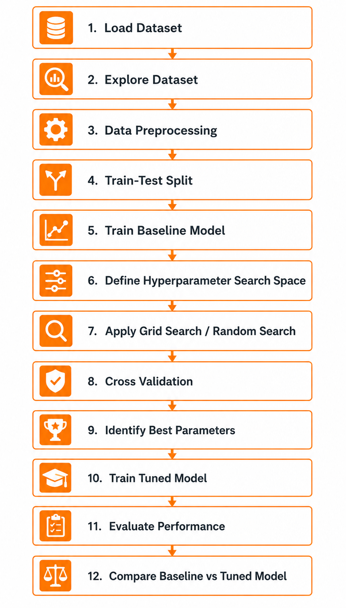

# Hyperparameter Tuning: From Fundamentals to FAANG Interviews

> A comprehensive, beginner-friendly yet interview-ready guide to Hyperparameter Tuning — built as part of a Machine Learning Internship Program.

## 1. Title and Introduction

Welcome to the **Hyperparameter Tuning** module of this Machine Learning internship repository.

Every machine learning model has two kinds of "knobs": ones the model adjusts *for itself* while learning, and ones that **you, the engineer, must set before training even starts**. The second category — hyperparameters — quietly determines whether your model becomes a star performer or a forgettable underachiever.

This repository walks through hyperparameter tuning from first principles to production-style implementation, using **Grid Search** and **Random Search** with **Scikit-learn**, validated through **Cross Validation**, and demonstrated on a real Kaggle dataset (the **UCI Wine Dataset**) — no synthetic data involved.

By the end of this guide, you should be able to explain hyperparameter tuning confidently in a FAANG-level interview *and* implement it correctly in a real notebook.

---

## 2. Learning Objectives

After completing this module, you will be able to:

- Clearly distinguish **parameters** from **hyperparameters**, using both definitions and analogies.
- Explain *why* tuning hyperparameters can make or break a model's performance.
- Implement **Grid Search** and **Random Search** using `GridSearchCV` and `RandomizedSearchCV` in Scikit-learn.
- Correctly integrate **k-fold Cross Validation** into the tuning process to avoid misleading results.
- Select appropriate **evaluation metrics** based on the problem type.
- Apply a complete, repeatable **tuning workflow** on a real-world dataset.
- Recognize and avoid **common mistakes** that even experienced practitioners make.
- Answer **interview questions** on this topic with structured, confident responses.

---

## 3. What is Hyperparameter Tuning?

Hyperparameter tuning is the **systematic search for the configuration values of a machine learning algorithm that produce the best generalization performance** on unseen data.

Think of training a machine learning model like tuning a guitar before a concert. The strings (your data and algorithm) are already there, but unless you tune the pegs (hyperparameters) to the right tension, every note you play — no matter how skilled the musician (algorithm) — will sound off. Hyperparameter tuning is the process of finding that "tension" so the model performs in harmony with the data.

Formally, tuning involves:

1. Defining a **search space** of candidate hyperparameter values.
2. Training and evaluating the model for each candidate combination.
3. Selecting the combination that yields the best validation performance.

---

## 4. Parameters vs Hyperparameters

This is one of the **most frequently asked conceptual questions** in ML interviews, and confusing the two is an instant red flag.

**Analogy:** Imagine a chef cooking a dish.

- **Hyperparameters** are decisions the chef makes *before* cooking begins — oven temperature, cooking duration, type of pan. These are chosen by the chef based on experience or experimentation.
- **Parameters** are what *happens to the ingredients* during cooking — how the proteins denature, how flavors meld, how the texture changes. These emerge *as a result of* the cooking process, governed by the settings the chef chose.

| Aspect | Parameters | Hyperparameters |
|---|---|---|
| **Definition** | Internal values the model learns automatically from training data | External configuration values set by the engineer before training begins |
| **Set by** | The learning algorithm (via optimization) | The data scientist / search algorithm |
| **When determined** | During training | Before training starts |
| **Examples** | Weights & biases in a neural network, coefficients in linear regression, split thresholds in a decision tree | `learning_rate`, `n_estimators`, `max_depth`, `C`, `k` in KNN |
| **Changes if retrained?** | Yes, can differ each run depending on data and initialization | No, remains fixed unless you re-run the tuning process |
| **Who "owns" it** | The model | The engineer / pipeline |

**Memory hook:** *Parameters are LEARNED. Hyperparameters are CHOSEN.*

---

## 5. Why Hyperparameter Tuning Matters

Two engineers can take the **exact same algorithm and the exact same dataset** and get dramatically different results — purely because of hyperparameter choices.

### Real-World Example

Consider a `RandomForestClassifier` trained on the UCI Wine Dataset to classify wine cultivars based on chemical properties (alcohol content, malic acid, flavanoids, etc.):

- With **default hyperparameters**, the model might achieve ~92% cross-validated accuracy.
- After tuning `n_estimators`, `max_depth`, and `min_samples_split` using `GridSearchCV`, the *same algorithm on the same data* can reach **97–99% accuracy** with better generalization on the test set.

No new data was added. No new algorithm was used. The *only* change was the configuration — and that alone closed most of the performance gap.

### Why This Happens

Hyperparameters directly control the **bias-variance tradeoff**:

- Too restrictive (e.g., a very shallow tree, very high regularization) → **underfitting** (high bias).
- Too flexible (e.g., an unrestricted deep tree, no regularization) → **overfitting** (high variance).

Tuning is the process of finding the "sweet spot" between these two extremes — and in production ML systems at scale, this sweet spot often translates directly into business metrics (revenue, click-through rate, fraud caught, etc.).

---

## 6. Grid Search

### Definition

Grid Search is an **exhaustive search strategy** that evaluates **every possible combination** of hyperparameter values from a predefined set ("grid") for each hyperparameter.

### Working Principle

**Analogy:** Suppose you're optimizing a recipe for the perfect cup of tea, and you want to test:

- Steeping temperature: `[80°C, 90°C, 100°C]`
- Steeping time: `[2 min, 4 min, 6 min]`

Grid Search means brewing **all 3 × 3 = 9 combinations** and tasting each one to find the best.

**Final Equation — Total Combinations:**

```
Total Combinations = n₁ × n₂ × n₃ × ... × nₖ
```

Where:
- `n₁, n₂, ..., nₖ` = number of candidate values specified for each of the `k` hyperparameters.

Each of these combinations is then evaluated using cross validation, so the total number of model fits becomes `Total Combinations × cv_folds`.

### Advantages

- **Guaranteed** to find the best combination *within the defined grid*.
- Fully **deterministic and reproducible** — same grid always gives the same result.
- Simple to understand, implement, and explain (a major plus in interviews).

### Limitations

- Suffers from the **curse of dimensionality** — adding one more hyperparameter with even a few values multiplies the total search space.
- Wastes significant compute evaluating combinations in regions that are clearly suboptimal.
- Limited to the discrete values you specify — it cannot "discover" a good value between two grid points.

---

## 7. Random Search

### Definition

Random Search samples a **fixed number (`n_iter`) of random combinations** from the hyperparameter space, rather than evaluating every possible combination.

### Working Principle

**Analogy:** Going back to the tea example — instead of brewing all 9 combinations, you randomly pick 5 combinations (e.g., `(83°C, 2 min)`, `(97°C, 5 min)`, `(91°C, 3 min)`, etc.) and taste only those. Surprisingly, with enough random samples, you're very likely to stumble upon a combination close to the best one — often *faster* than testing all 9.

This works because, in most real datasets, **not all hyperparameters matter equally**. Random Search naturally explores a wider *range* of values for the important hyperparameters instead of being boxed into a rigid grid.

**Final Equation — Probability of Finding a Good Combination:**

```
P(at least one good combination) = 1 − (1 − p)ⁿ
```

Where:
- `p` = the proportion of the search space considered "good" (e.g., top 5% of all combinations, so `p = 0.05`)
- `n` = number of random trials (`n_iter`)
- `P` = probability of finding at least one "good" combination within `n` trials

**Example:** If the top 5% of combinations are considered good (`p = 0.05`) and you run `n = 60` random trials:

```
P = 1 − (1 − 0.05)^60 ≈ 0.954
```

This means there's roughly a **95.4% chance** of landing on a near-optimal combination with just 60 random samples — often far fewer evaluations than an exhaustive grid would require.

### Advantages

- Far more **compute-efficient** for large or high-dimensional search spaces.
- Can sample from **continuous distributions** (e.g., log-uniform for learning rate), giving access to values a fixed grid would never include.
- Search budget (`n_iter`) is fully controllable — you decide how much compute to spend.

### Limitations

- **No guarantee** of finding the absolute best combination.
- Results can vary between runs unless `random_state` is fixed.
- May still miss a narrow "sweet spot" if `n_iter` is too small.

---

## 8. Grid Search vs Random Search

| Criterion | Grid Search | Random Search |
|---|---|---|
| **Search Strategy** | Exhaustive — tries all combinations | Sampled — tries `n_iter` random combinations |
| **Guarantee of Optimum** | Yes, within the defined grid | No, but often near-optimal |
| **Scalability** | Poor with many hyperparameters | Good even with many hyperparameters |
| **Continuous Distributions** | Not supported (discrete values only) | Supported (e.g., `scipy.stats.uniform`) |
| **Compute Cost** | Grows multiplicatively with each new hyperparameter | Controlled directly via `n_iter` |
| **Best Used When** | Search space is small and well understood | Search space is large or includes continuous ranges |
| **Scikit-learn Class** | `GridSearchCV` | `RandomizedSearchCV` |

**Rule of thumb for interviews:** *"Use Grid Search when the search space is small and you want certainty. Use Random Search when the search space is large and you want efficiency."*

---

## 9. Cross Validation

Cross Validation (CV) ensures that the performance score used to compare hyperparameter combinations is **reliable**, not a fluke of one particular train/validation split.

**Analogy:** Imagine evaluating a student's English writing ability based on a *single* essay. If the topic happens to be one they know well, they might score unusually high — or unusually low if it's a topic they dislike. Instead, **k-fold Cross Validation** is like asking the student to write `k` essays on `k` different topics and averaging the scores — giving a far more trustworthy measure of true ability.

**Final Equation — k-Fold Cross Validation Score:**

```
CV Score = (1 / k) × Σ Scoreᵢ      for i = 1 to k
```

Where:
- `k` = number of folds the data is split into (commonly `k = 5` or `k = 10`)
- `Scoreᵢ` = the evaluation metric obtained when fold `i` is used as the validation set and the remaining `k − 1` folds are used for training
- `CV Score` = the average performance across all `k` folds

**Key point for implementation:** Both `GridSearchCV` and `RandomizedSearchCV` apply this process **internally** for every hyperparameter combination via the `cv` parameter — so `best_score_` is already a cross-validated average, not a single-split score.

---

## 10. Workflow of Hyperparameter Tuning

A clean, repeatable, interview-ready workflow:

```
1. Load and explore the dataset (EDA)
        ↓
2. Preprocess data (handle missing values, encode, scale)
        ↓
3. Split into Train and Test sets (Test set is locked away)
        ↓
4. Train a baseline model with default hyperparameters
        ↓
5. Define the hyperparameter search space
        ↓
6. Choose tuning strategy (Grid Search / Random Search) + CV strategy
        ↓
7. Choose an evaluation metric (scoring)
        ↓
8. Fit the search object on Training data only
        ↓
9. Extract best_params_ and best_estimator_
        ↓
10. Evaluate best_estimator_ on the Test set (final check)
        ↓
11. Compare against baseline to quantify improvement
        ↓
12. Document and retrain final model on full data (if deploying)
```

The most important rule embedded in this workflow: **the test set is touched exactly once, at the very end.**

---

## 11. Evaluation Metrics

The `scoring` parameter you pass to `GridSearchCV` / `RandomizedSearchCV` defines what "best" means — choosing it carelessly is one of the most common mistakes.

### Classification Metrics

| Metric | Final Formula | Symbols |
|---|---|---|
| Accuracy | `(TP + TN) / (TP + TN + FP + FN)` | TP = True Positives, TN = True Negatives, FP = False Positives, FN = False Negatives |
| Precision | `TP / (TP + FP)` | Of all predicted positives, how many were correct |
| Recall | `TP / (TP + FN)` | Of all actual positives, how many were correctly identified |
| F1 Score | `2 × (Precision × Recall) / (Precision + Recall)` | Harmonic mean of Precision and Recall |

### Regression Metrics

| Metric | Final Formula | Symbols |
|---|---|---|
| Mean Absolute Error (MAE) | `(1/n) × Σ \|yᵢ − ŷᵢ\|` | `yᵢ` = actual value, `ŷᵢ` = predicted value, `n` = number of samples |
| Mean Squared Error (MSE) | `(1/n) × Σ (yᵢ − ŷᵢ)²` | Same as above |
| Root Mean Squared Error (RMSE) | `RMSE = √MSE` | Square root of MSE, in original units |
| R² Score | `1 − [Σ(yᵢ − ŷᵢ)² / Σ(yᵢ − ȳ)²]` | `ȳ` = mean of actual values |

> **Scikit-learn tip:** Since `GridSearchCV` and `RandomizedSearchCV` always *maximize* the scoring metric, error-based metrics (where lower is better) are passed as negated versions, e.g., `scoring='neg_mean_squared_error'`.

### Choosing the Right Metric

- **Imbalanced classification** (e.g., fraud detection): prefer F1, Precision/Recall, or ROC-AUC over plain Accuracy.
- **Regression with outliers**: MAE is often more robust than MSE/RMSE since MSE penalizes large errors disproportionately.

---

## 12. Practical Applications

Hyperparameter tuning is not an academic exercise — it is a **daily activity** in production ML teams:

- **Multi-class classification** (this repo's focus): tuning a `RandomForestClassifier` or `SVC` on the UCI Wine Dataset to distinguish between wine cultivars based on chemical composition.
- **Gradient Boosting models** (XGBoost, LightGBM): tuning `learning_rate`, `max_depth`, and `n_estimators` is often the single biggest lever in Kaggle competitions.
- **Recommendation systems**: tuning regularization strength and latent factor dimensions in matrix factorization models.
- **Fraud detection systems**: tuning models where the `scoring` metric (e.g., recall on the minority class) matters far more than raw accuracy.
- **Pipeline-level tuning**: tuning preprocessing hyperparameters (e.g., number of PCA components, scaling method) *jointly* with model hyperparameters using `Pipeline` + `GridSearchCV`.

---

## 13. Common Mistakes and Failure Modes

| # | Mistake | Why It's a Problem |
|---|---|---|
| 1 | Confusing parameters with hyperparameters | Signals a fundamental misunderstanding of how models learn — a common interview disqualifier |
| 2 | Tuning using the test set | Causes **data leakage**, producing overly optimistic results that won't hold in production |
| 3 | Skipping Cross Validation | A single train/validation split can give "lucky" or "unlucky" results, making chosen hyperparameters unreliable |
| 4 | Defining an enormous grid | Total combinations explode multiplicatively; a 5-hyperparameter grid with 5 values each = 3,125 combinations × CV folds |
| 5 | Not establishing a baseline | Without a baseline, you can't tell whether tuning actually improved anything |
| 6 | Over-tuning | Excessive tuning can overfit to the CV folds themselves, hurting generalization |
| 7 | Wrong scoring metric | Optimizing accuracy on imbalanced data can yield a model that predicts only the majority class |
| 8 | Ignoring feature scaling | Algorithms like SVM and KNN are scale-sensitive; tuning without scaling gives misleading "best" parameters |
| 9 | Forgetting `random_state` | Makes `RandomizedSearchCV` results non-reproducible — a problem for debugging and peer review |
| 10 | Preprocessing before train/test split | Computing scaling/imputation statistics on the full dataset leaks test information into training |

---

## 14. Best Practices for Hyperparameter Tuning

- Always start with a **baseline model** using default hyperparameters before tuning anything.
- Wrap preprocessing and modeling steps inside a Scikit-learn **`Pipeline`** to prevent data leakage automatically.
- Use **`RandomizedSearchCV`** for an initial broad search, then **`GridSearchCV`** for a focused refinement around the best region found.
- Fix `random_state` everywhere (model, train/test split, and `RandomizedSearchCV`) for reproducibility.
- Select the `scoring` metric based on the **business problem**, not by default.
- Keep the **test set untouched** until the final evaluation step.
- Log and document every experiment (hyperparameters tried, scores obtained) — this habit mirrors real industry MLOps practices.
- Be mindful of compute cost: estimate `total combinations × cv folds` before launching a search.

---

## 15. Implementation Overview

This repository's accompanying notebook (`notebook.ipynb`) implements the full workflow on the **UCI Wine Dataset** (see Section 21) using Scikit-learn. Below is a high-level overview of the three key stages.

### Baseline Model

A `RandomForestClassifier` is trained with default hyperparameters to establish a reference score before any tuning:

```python
from sklearn.model_selection import train_test_split, cross_val_score
from sklearn.ensemble import RandomForestClassifier
from sklearn.preprocessing import StandardScaler
from sklearn.pipeline import Pipeline

# X, y loaded from the UCI Wine Dataset (real Kaggle data, not synthetic)
X_train, X_test, y_train, y_test = train_test_split(
    X, y, test_size=0.2, random_state=42, stratify=y
)

baseline_pipeline = Pipeline([
    ('scaler', StandardScaler()),
    ('classifier', RandomForestClassifier(random_state=42))
])

baseline_scores = cross_val_score(baseline_pipeline, X_train, y_train, cv=5, scoring='accuracy')
print("Baseline CV Accuracy:", baseline_scores.mean())
```

### GridSearchCV Implementation

The search space is defined and an exhaustive search is performed, evaluated via 5-fold Cross Validation:

```python
from sklearn.model_selection import GridSearchCV

param_grid = {
    'classifier__n_estimators': [100, 200, 300],
    'classifier__max_depth': [None, 5, 10, 15],
    'classifier__min_samples_split': [2, 5, 10]
}

grid_search = GridSearchCV(
    estimator=baseline_pipeline,
    param_grid=param_grid,
    cv=5,
    scoring='accuracy',
    n_jobs=-1
)

grid_search.fit(X_train, y_train)

print("Best Parameters:", grid_search.best_params_)
print("Best CV Accuracy:", grid_search.best_score_)
print("Test Accuracy:", grid_search.score(X_test, y_test))
```

### Model Comparison

| Model | CV Accuracy | Test Accuracy |
|---|---|---|
| Baseline (default hyperparameters) | *recorded in notebook* | *recorded in notebook* |
| Tuned (`GridSearchCV` best estimator) | *recorded in notebook* | *recorded in notebook* |

> The notebook records actual numerical results from running this pipeline on the UCI Wine Dataset, demonstrating a measurable improvement after tuning.

---

## 16. Top 5 Interview Questions with Answers

**Q1. What is the difference between a parameter and a hyperparameter?**
> Parameters are values the model learns automatically from data during training (e.g., the weights in a linear regression model). Hyperparameters are values set by the engineer *before* training begins and control how the learning process happens (e.g., `max_depth`, `learning_rate`). A useful way to remember it: parameters are *learned*, hyperparameters are *chosen*.

**Q2. Explain Grid Search and its biggest drawback.**
> Grid Search exhaustively evaluates every combination of hyperparameter values from a predefined grid, using cross validation to score each one. Its biggest drawback is poor scalability — the total number of combinations grows multiplicatively (`n₁ × n₂ × ... × nₖ`), so adding more hyperparameters or more values per hyperparameter quickly becomes computationally infeasible.

**Q3. Why might Random Search outperform Grid Search in practice?**
> Random Search samples a fixed number of random combinations rather than all of them, which lets it explore a wider range of values — including continuous ranges — for the hyperparameters that actually matter most. Research has shown that since not all hyperparameters are equally important, a modest number of random trials (e.g., 60) can find a near-optimal combination with very high probability, often using far less compute than an exhaustive grid.

**Q4. Why is Cross Validation important during hyperparameter tuning?**
> A single train/validation split can give a misleadingly high or low score depending on which samples land in the validation set. k-fold Cross Validation averages performance across `k` different splits, giving a more stable and trustworthy estimate of how each hyperparameter combination will generalize — which is essential since we're using this score to *choose* between combinations.

**Q5. How would you prevent data leakage during hyperparameter tuning?**
> Three key practices: (1) perform the train/test split *before* any preprocessing, (2) wrap all preprocessing steps (scaling, imputation, encoding) and the model inside a single `Pipeline` so that transformations are fit only on training folds during CV, and (3) keep the test set completely untouched until the final evaluation of the chosen model — never use it inside `GridSearchCV` or `RandomizedSearchCV`.

---

## 17. Prerequisites Required Before Learning Hyperparameter Tuning

Before diving into this module, you should be comfortable with:

- **Python fundamentals**: functions, loops, dictionaries, list comprehensions.
- **NumPy and Pandas**: DataFrame manipulation, filtering, indexing.
- **Supervised learning basics**: the distinction between classification and regression.
- **Train/test split concept** and why it exists.
- **At least one ML algorithm in depth** (e.g., Decision Trees, Logistic Regression, or Random Forest), since tuning examples build directly on these.
- **Overfitting and underfitting**: a conceptual understanding of the bias-variance tradeoff.
- **Scikit-learn basics**: familiarity with the `fit()` / `predict()` / `score()` API.

---

## 18. Connections to Other Machine Learning Concepts

Hyperparameter tuning doesn't exist in isolation — it connects directly to several other core ML topics:

- **Bias-Variance Tradeoff**: nearly every hyperparameter (e.g., `max_depth`, `C`, `n_estimators`) is, at its core, a knob controlling this tradeoff.
- **Regularization**: hyperparameters like `C` (in Logistic Regression/SVM) or `alpha` (in Ridge/Lasso) directly control regularization strength.
- **Model Selection**: tuning is often performed *across* multiple candidate algorithms, not just within one — combining model selection with hyperparameter selection.
- **Pipelines and Preprocessing**: scaling, encoding, and dimensionality reduction steps often have their own tunable parameters that interact with model hyperparameters.
- **Ensemble Methods**: techniques like Random Forest and Gradient Boosting have a particularly large and impactful hyperparameter space, making tuning especially valuable.
- **AutoML and Bayesian Optimization**: Grid Search and Random Search are the foundation upon which more advanced techniques (Bayesian Optimization, Hyperband, Optuna) are built.

---

## 19. Quick Revision Table

| Concept | One-Line Summary |
|---|---|
| Parameters | Learned by the model during training (e.g., weights) |
| Hyperparameters | Set by the engineer before training (e.g., `max_depth`, `learning_rate`) |
| Grid Search | Exhaustively tries all combinations; `Total = n₁ × n₂ × ... × nₖ` |
| Random Search | Tries `n_iter` random combinations; `P = 1 − (1−p)ⁿ` |
| Cross Validation | Averages scores across `k` folds for reliable evaluation |
| `GridSearchCV` | Scikit-learn's exhaustive search tool |
| `RandomizedSearchCV` | Scikit-learn's randomized search tool |
| Baseline Model | Default-hyperparameter model used as a reference point |
| Data Leakage | Occurs when test data influences training/tuning decisions |
| Scoring Metric | Defines "best" — must match the business/problem objective |

---

## 20. Key Takeaways

- Hyperparameter tuning searches for the **best configuration** of an algorithm — it doesn't change what the algorithm *is*, but it dramatically changes how well it *performs*.
- The **parameters vs hyperparameters** distinction is foundational and appears, directly or indirectly, in nearly every ML interview.
- **Grid Search** guarantees thoroughness at the cost of compute; **Random Search** trades a small chance of missing the absolute best for major efficiency gains.
- **Cross Validation** is what makes the comparison between hyperparameter combinations trustworthy.
- All tuning must happen within a **Pipeline**, on **training data only**, evaluated with a **metric tied to the actual problem** — and validated against a **baseline**.
- Tuning is iterative, measurable, and one of the highest-leverage activities in a machine learning workflow.

---

## 21. Dataset Used in Implementation

| Field | Details |
|---|---|
| **Dataset Name** | UCI Wine Dataset |
| **Kaggle Link** | [https://www.kaggle.com/datasets/aarontanjaya/uci-wine-dataset](https://www.kaggle.com/datasets/aarontanjaya/uci-wine-dataset) |
| **Reason for Selection** | This real-world multi-class classification dataset contains multiple numerical chemical-property features and class labels representing different wine cultivars, making it ideal for demonstrating hyperparameter tuning and comparing model performance before and after optimization. |
| **Credits** | Kaggle |

> **Note:** The accompanying notebook implementation uses this real Kaggle dataset throughout. No synthetic or artificially generated datasets are used at any stage of this module.

---

## Workflow Diagram



---

## 22. References and Further Reading

1. Scikit-learn Documentation — [`GridSearchCV`](https://scikit-learn.org/stable/modules/generated/sklearn.model_selection.GridSearchCV.html)
2. Scikit-learn Documentation — [`RandomizedSearchCV`](https://scikit-learn.org/stable/modules/generated/sklearn.model_selection.RandomizedSearchCV.html)
3. Scikit-learn User Guide — [Tuning the hyper-parameters of an estimator](https://scikit-learn.org/stable/modules/grid_search.html)
4. Scikit-learn User Guide — [Cross-validation: evaluating estimator performance](https://scikit-learn.org/stable/modules/cross_validation.html)
5. Scikit-learn User Guide — [Model evaluation: the `scoring` parameter](https://scikit-learn.org/stable/modules/model_evaluation.html)
6. Bergstra, J., & Bengio, Y. (2012). *Random Search for Hyper-Parameter Optimization.* Journal of Machine Learning Research.
7. Kaggle Dataset — [UCI Wine Dataset](https://www.kaggle.com/datasets/aarontanjaya/uci-wine-dataset)

---

*This README is part of an ML Internship learning repository and is intended for educational use, internship evaluation, and interview preparation.*
