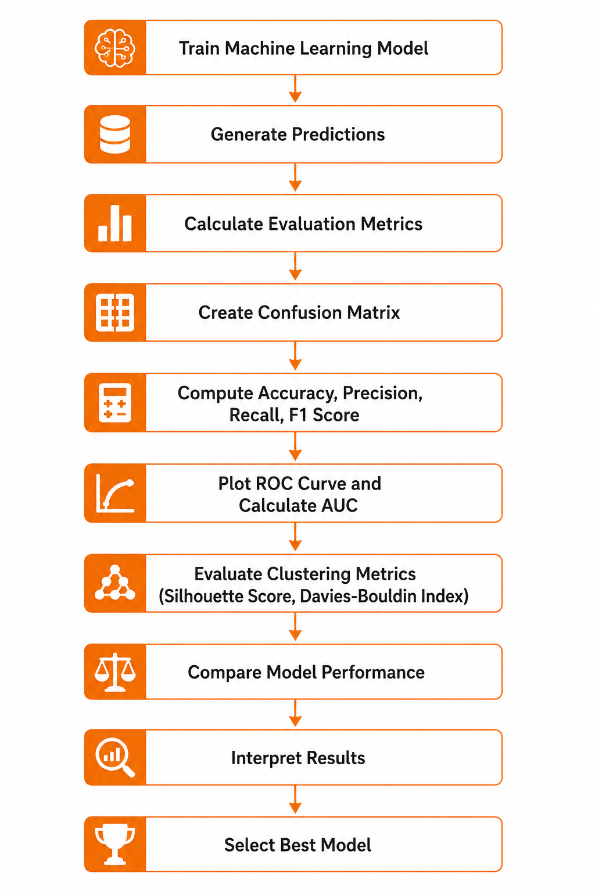

# Machine Learning Model Evaluation

## Introduction

Model Evaluation is the process of measuring how well a machine learning model performs on unseen data. Proper evaluation helps determine whether a model generalizes well and assists in selecting the best model for deployment.

Model evaluation is important for both supervised and unsupervised learning algorithms.

---

## Learning Objectives

* Understand model evaluation concepts.
* Learn classification metrics.
* Learn regression metrics.
* Understand confusion matrix.
* Learn ROC and AUC.
* Evaluate clustering models.
* Understand interview-oriented evaluation concepts.

---

## Why Model Evaluation Matters

A model may perform well on training data but fail on unseen data.

Model evaluation helps:

* Measure performance.
* Detect overfitting.
* Compare models.
* Improve generalization.

---

## Supervised Learning Evaluation

### Classification Metrics

#### Accuracy

Formula:

Accuracy = (TP + TN) / (TP + TN + FP + FN)

Advantages:

* Easy to understand.

Limitations:

* Misleading for imbalanced datasets.

---

#### Precision

Formula:

Precision = TP / (TP + FP)

Focus:

* How many predicted positives are actually positive.

---

#### Recall

Formula:

Recall = TP / (TP + FN)

Focus:

* How many actual positives are correctly identified.

---

#### F1 Score

Formula:

F1 = 2 × (Precision × Recall) / (Precision + Recall)

Use Case:

* Imbalanced datasets.

---

## Confusion Matrix

Components:

* True Positive (TP)
* True Negative (TN)
* False Positive (FP)
* False Negative (FN)

---

## ROC Curve

Receiver Operating Characteristic Curve plots:

* True Positive Rate
* False Positive Rate

---

## AUC Score

Area Under Curve

Interpretation:

* 1.0 → Perfect Model
* 0.5 → Random Guessing

---

## Regression Metrics

### MAE

Mean Absolute Error

### MSE

Mean Squared Error

### RMSE

Root Mean Squared Error

### R² Score

Coefficient of Determination

---

## Unsupervised Learning Evaluation

### Silhouette Score

Measures cluster separation.

Higher Score → Better Clustering

---

### Davies-Bouldin Index

Measures cluster similarity.

Lower Score → Better Clustering

---

### Calinski-Harabasz Index

Measures cluster density and separation.

Higher Score → Better Clustering

---

## Applications

* Model Selection
* Hyperparameter Tuning
* Business Decision Making
* Deployment Validation

---

## Workflow Diagram

---

## Interview Questions

1. Why is accuracy misleading?

2. Difference between Precision and Recall?

3. When should F1 Score be used?

4. What is a Confusion Matrix?

5. What is ROC-AUC?

6. How do we evaluate clustering models?

7. What is Silhouette Score?

8. Difference between MAE and RMSE?

9. What is R² Score?

10. How do we compare machine learning models?

---

## Key Takeaways

* Evaluation measures model performance.
* Accuracy alone is not sufficient.
* Precision, Recall, and F1 Score provide deeper insights.
* ROC-AUC evaluates classification capability.
* Silhouette Score evaluates clustering quality.
* Proper evaluation improves model reliability.

---

## References

* Scikit-learn Documentation
* GeeksforGeeks
* Towards Data Science
* Medium Machine Learning Blogs
